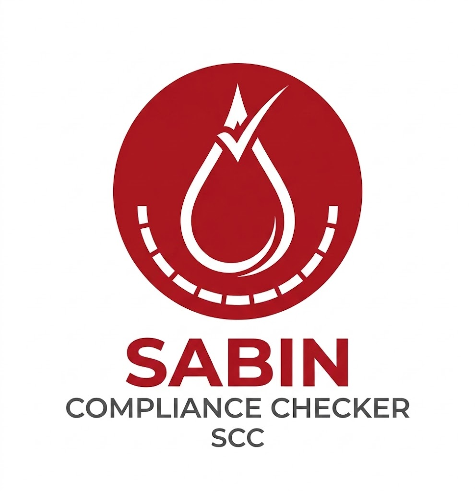

# Sabin Compliance Checkr (SCC)

## Introdução

Este repositório tem como propósito fornecer um checklist prático de conformidade e acessibilidade para projetos, principalmente de desenvolvimento de software, que incluem: desenvolvimento web, design, geração de conteúdo e gestão de projetos.

## Sobre o Projeto

O **Sabin Compliance Checkr (SCC)** é um projeto criado a partir do curso de Interação Humano Computador, ministrado pela docente Rejane Maria da Costa Figueiredo, na Universidade de Brasília (UnB).

## Equipe — IHC 2026.1 Grupo 07

  <table>
    <tr>
      <td align="center"><a href="https://github.com/Bappoz"> <b>Bappoz</b></a></td>
      <td align="center"><a href="https://github.com/guxvr"> <b>guxvr</b></a></td>
      <td align="center"><a href="https://github.com/TiagoSBittencourt"> <b>TiagoSBittencourt</b></a></td>
      <td align="center"><a href="https://github.com/pedruck"> <b>pedruck</b></a></td>
      <td align="center"><a href="https://github.com/Bercacos"> <b>Bercacos</b></a></td>
    </tr>
  </table>

