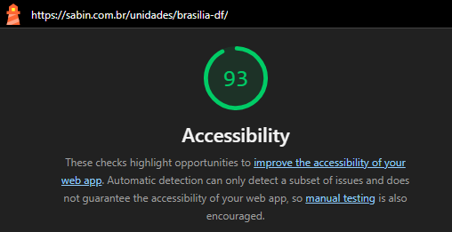
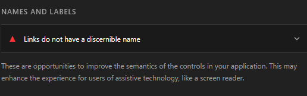
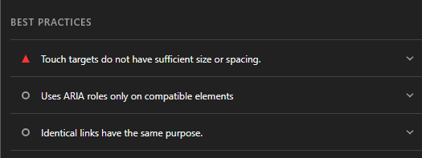
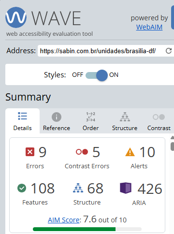
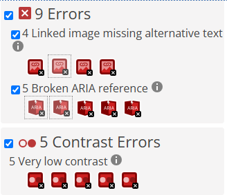
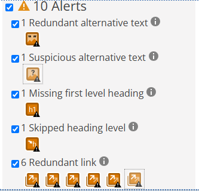
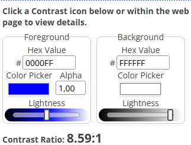
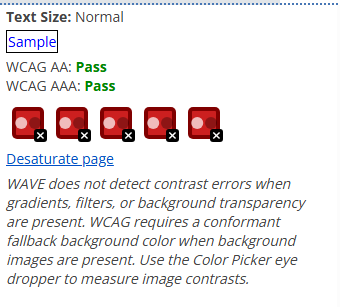
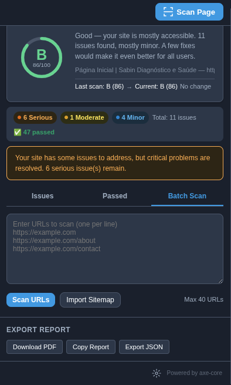

# Ferramentas Utilizadas

## Lighthouse

O Lighthouse é uma ferramenta integrada aos navegadores baseados em Chromium utilizada para auditoria automática de páginas web.

### Configuração

* Navegador: Brave Browser
* Categoria avaliada: Accessibility
* Modo: Mobile
* Página analisada: Unidade Brasília-DF do site Sabin

### Resultado

A página analisada obteve pontuação de **93/100** em acessibilidade.

### Problemas Identificados

#### Links sem nome discernível

Foram encontrados links sem nome acessível adequadamente definido, dificultando a interpretação por tecnologias assistivas.

**Referência:** WCAG 2.2 – Critério 4.1.2 (Name, Role, Value)

#### Área de toque insuficiente

Foram identificados elementos interativos com tamanho ou espaçamento reduzido para interação em dispositivos móveis.

**Referência:** WCAG 2.2 – Critério 2.5.8 (Target Size – Minimum)

### Evidências

-   

    ---

    **Pontuação geral** · 93/100 em Accessibility, auditado na unidade Brasília-DF

-   

    ---

    **Nomes e rótulos** · links sem nome discernível para tecnologias assistivas

-   

    ---

    **Boas práticas** · alvos de toque sem tamanho/espaçamento suficiente

---

## WAVE

O WAVE (Web Accessibility Evaluation Tool) foi utilizado para complementar a avaliação automática de acessibilidade e identificar problemas relacionados à estrutura semântica, textos alternativos e contraste.

### Resultados Gerais

| Categoria           | Quantidade |
| ------------------- | ---------- |
| Errors              | 9          |
| Contrast Errors     | 5          |
| Alerts              | 10         |
| Features            | 108        |
| Structural Elements | 68         |
| ARIA                | 426        |

### Erros Encontrados

#### Linked Image Missing Alternative Text

Foram identificadas 4 imagens utilizadas como links sem texto alternativo.

**Referência:** WCAG 2.2 – Critério 1.1.1 (Non-text Content)

#### Broken ARIA Reference

Foram identificadas 5 referências ARIA inválidas.

**Referência:** WCAG 2.2 – Critério 4.1.2 (Name, Role, Value)

### Problemas de Contraste

Foram identificados 5 elementos com contraste muito baixo entre texto e fundo.

**Referência:** WCAG 2.2 – Critério 1.4.3 (Contrast Minimum)

### Alertas Encontrados

* 1 texto alternativo redundante;
* 1 texto alternativo suspeito;
* 1 ausência de cabeçalho de primeiro nível (H1);
* 1 salto na hierarquia de títulos;
* 6 links redundantes.

### Evidências

-   

    ---

    **Resumo geral** · 9 errors, 5 contrast errors, 10 alerts, 426 ARIA

-   

    ---

    **Erros** · imagens-link sem texto alternativo e referências ARIA inválidas

-   

    ---

    **Alertas** · ausência de H1, salto de hierarquia e links redundantes

-   

    ---

    **Contraste (1/2)** · elementos com contraste insuficiente entre texto e fundo

-   

    ---

    **Contraste (2/2)** · continuação dos elementos com contraste insuficiente

---

## AccessCheck

O AccessCheck é uma extensão baseada no motor **axe-core** (Deque Systems), utilizada para uma terceira verificação automatizada, cruzando os achados do Lighthouse e do WAVE com outra base de regras.

### Configuração

* Página analisada: Página Inicial / Unidade Brasília-DF do site Sabin
* Motor de varredura: axe-core 4.10

### Resultado

A página obteve nota **B (86/100)** — classificada pela ferramenta como *"mostly accessible"*. Foram identificados **11 problemas** no total, além de **47 verificações aprovadas**.

| Severidade | Quantidade |
| ---------- | ---------- |
| Serious    | 6          |
| Moderate   | 1          |
| Minor      | 4          |
| **Total**  | **11**     |

### Problemas Identificados

#### ARIA Prohibited Attribute (Serious)

O atributo `aria-label` foi aplicado em elementos `
` sem um `role` válido — caso do carrossel de notícias (`cmp-carousel-cards__carousel`) e de sua paginação (`cmp-carousel-cards__pagination`). Sem um role associado, o `aria-label` é ignorado por leitores de tela.

**Referência:** WCAG 2.2 – Critério 4.1.2 (Name, Role, Value)

#### Link Name (Serious)

Dois links do banner rotativo da homepage usam `aria-label=""` (vazio) e não possuem texto visível, ficando completamente sem nome acessível para tecnologias assistivas.

**Referência:** WCAG 2.2 – Critério 2.4.4 / 4.1.2 (Link Purpose / Name, Role, Value)

#### Target Size (Serious)

Os marcadores de paginação do carrossel (`swiper-pagination-bullet`) possuem apenas **12×12px**, abaixo do mínimo de 24×24px, e espaçamento insuficiente (16px) entre alvos vizinhos.

**Referência:** WCAG 2.2 – Critério 2.5.8 (Target Size – Minimum)

#### Page Has Heading One (Moderate)

Confirma o achado já identificado pelo WAVE e pela Avaliação Heurística: a página não possui nenhum `<h1>`, prejudicando a navegação por cabeçalhos em leitores de tela.

**Referência:** WCAG 2.2 – Critério 1.3.1 (Info and Relationships)

#### ARIA Allowed Role (Minor)

Os slides do carrossel principal (`article.cmp-banner-rotativo-imagem__slide`) usam `role="group"`, que não é um role permitido para o elemento `<article>` — 4 ocorrências.

**Referência:** WCAG 2.2 – Critério 4.1.2 (Name, Role, Value) — boa prática ARIA

### Evidências

-   

    ---

    **Resumo geral** · nota B (86/100), 6 serious, 1 moderate, 4 minor, 47 aprovados

