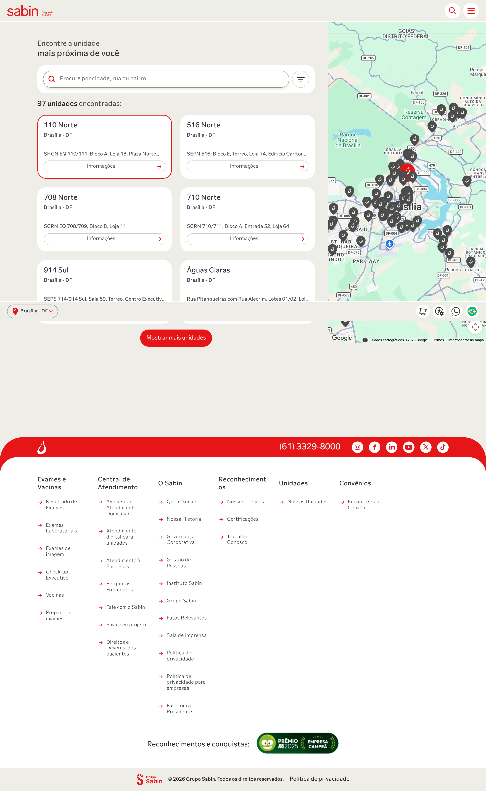
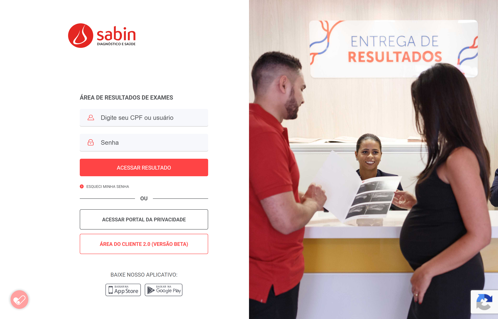
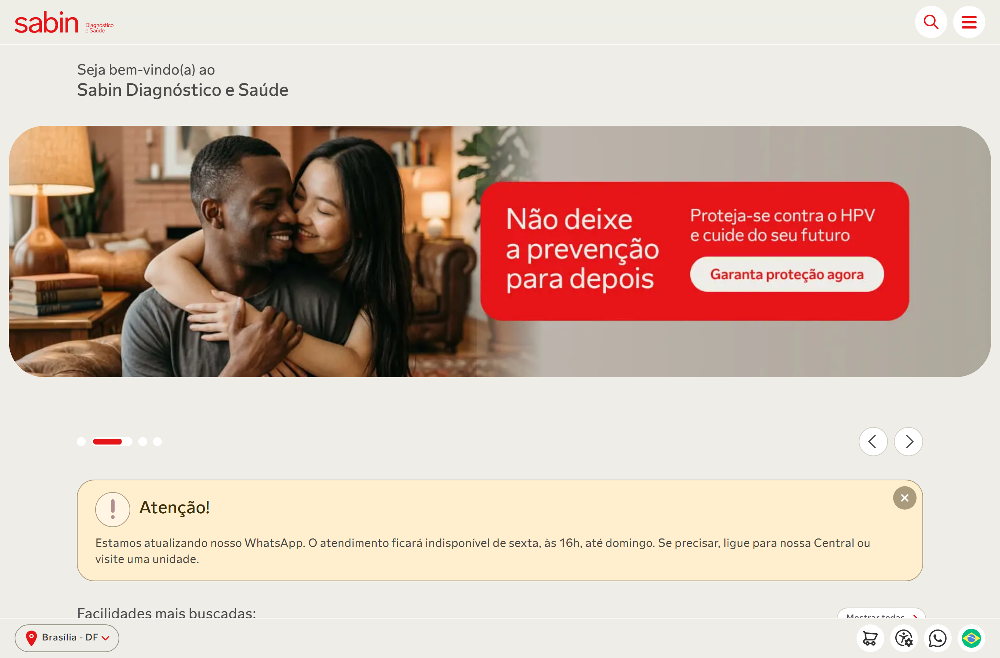
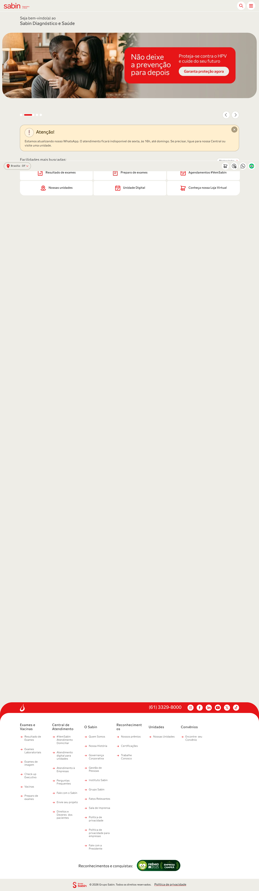
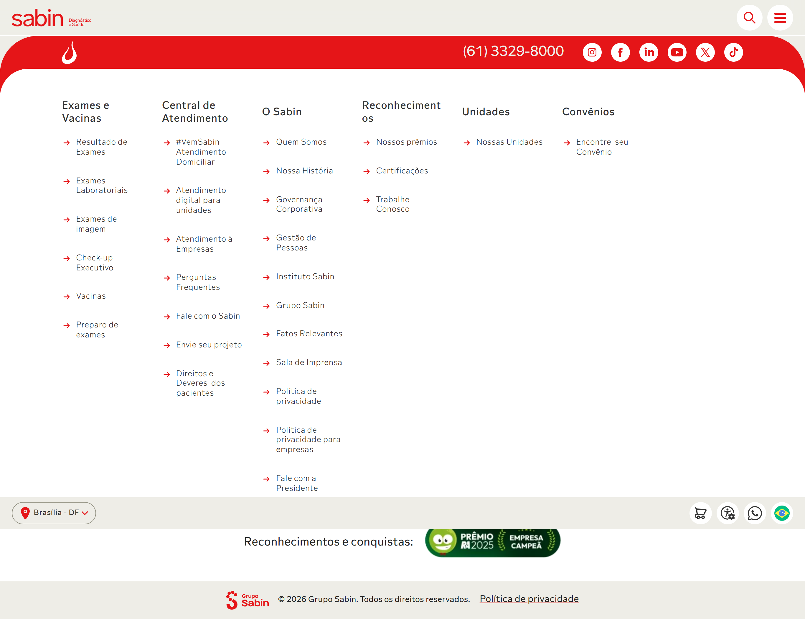

# Avaliação Heurística — Site Sabin Diagnóstico e Saúde

> **Método:** Avaliação Heurística de Nielsen (1994, revisado 2020), conforme descrito no [Guia PocketV2 — Heurísticas de Usabilidade](../../pocket-v2/heuristicas/heuristicas.md)
> **Site avaliado:** [sabin.com.br](https://www.sabin.com.br)
> **Data:** Junho/2026
> **Avaliadores:** Equipe IHC 2026.1 Grupo 07
> **Escopo:** Homepage, listagem de exames, buscador de unidades, portal de resultados, página de contato

As 10 heurísticas (H1–H10) e a escala de severidade usadas abaixo são as mesmas definidas no [Pocket V2](../../pocket-v2/heuristicas/heuristicas.md) — esta página aplica esse checklist ao site real do Sabin.

---

## Escala de Severidade

| Nível | Descrição |
|---|---|
| **0** | Não é problema de usabilidade |
| **1** | Cosmético — corrigir se houver tempo |
| **2** | Minor — causa frustração, mas o usuário consegue prosseguir |
| **3** | Major — impede ou atrapalha significativamente a tarefa |
| **4** | Catastrófico — impede o uso; bloqueador |

---

## Resumo dos Problemas Encontrados

| ID | Heurística | Severidade | Problema |
|---|---|---|---|
| HE-01 | H1 – Visibilidade do Status | 3 | Ausência de indicador de progresso no carregamento dinâmico da página de unidades |
| HE-02 | H1 – Visibilidade do Status | 2 | Página de resultados de exames não exibe estado de autenticação ou feedback de sessão ativa |
| HE-03 | H2 – Correspondência com o Mundo Real | 3 | Portal de resultados solicita "usuário" sem especificar qual credencial (CPF, e-mail, número de cadastro) |
| HE-04 | H2 – Correspondência com o Mundo Real | 1 | Typo no código-fonte: `data-error-title="Ops!" data-success-title="Obrigado!">Feedback titlte<` — string de desenvolvedor vazando para o DOM |
| HE-05 | H3 – Controle e Liberdade | 4 | URL `/agendamento/` retorna erro 404 — fluxo central do site completamente quebrado |
| HE-06 | H3 – Controle e Liberdade | 2 | Página de unidades exibe "0 unidades encontradas" sem ação de recuperação clara (sem sugestão alternativa) |
| HE-07 | H4 – Consistência e Padrões | 2 | Terminologia inconsistente: "Agendar", "#VemSabin", "Solicitar atendimento" e "Agendamentos" usados como sinônimos em diferentes partes do site |
| HE-08 | H4 – Consistência e Padrões | 1 | Rodapé contém seções de horário de atendimento duplicadas ("De atendimento" aparece duas vezes com mesmo conteúdo) |
| HE-09 | H5 – Prevenção de Erros | 2 | Campo de busca global com `autocomplete="off"` — impede reuso de pesquisas anteriores do navegador |
| HE-10 | H5 – Prevenção de Erros | 3 | Portal de resultados não oferece orientação sobre formato das credenciais, aumentando erros de preenchimento |
| HE-11 | H6 – Reconhecimento em vez de Lembrança | 4 | Homepage sem `<h1>` — hierarquia de títulos inicia em `<h2>`, violando estrutura semântica e prejudicando tecnologias assistivas |
| HE-12 | H6 – Reconhecimento em vez de Lembrança | 2 | Listagem de exames exibe apenas nome + "Ver detalhes" — usuário precisa clicar para ver preparo, sem contexto mínimo na lista |
| HE-13 | H6 – Reconhecimento em vez de Lembrança | 3 | Ausência de breadcrumb/migalha de pão em páginas internas — usuário perde referência de onde está na hierarquia |
| HE-14 | H7 – Flexibilidade e Eficiência | 2 | Listagem de exames sem atalho rápido para iniciar agendamento diretamente do card do exame |
| HE-15 | H7 – Flexibilidade e Eficiência | 1 | Sem atalhos de teclado documentados para ações frequentes (busca, agendamento) |
| HE-16 | H8 – Estética e Design Minimalista | 2 | Homepage visualmente densa: 112 imagens carregadas, múltiplos carrosséis e seções concorrentes na mesma rolagem |
| HE-17 | H8 – Estética e Design Minimalista | 1 | Formulário de newsletter posicionado no meio do conteúdo principal, interrompendo o fluxo de informação |
| HE-18 | H9 – Ajuda para Recuperar de Erros | 4 | Página 404 do agendamento não oferece rota alternativa para a função de agendamento — usuário fica sem saída |
| HE-19 | H9 – Ajuda para Recuperar de Erros | 2 | Portal de resultados: mensagem "esqueci minha senha" presente, mas sem orientação sobre tempo de resposta ou próximos passos |
| HE-20 | H10 – Ajuda e Documentação | 2 | Nenhuma ajuda contextual no portal de resultados — usuário sem suporte no ponto de maior dúvida (login) |
| HE-21 | H10 – Ajuda e Documentação | 1 | FAQ acessível pelo menu, mas sem mecanismo de busca dentro da seção de perguntas frequentes |

---

## Análise Detalhada por Heurística

---

### H1 – Visibilidade do Status do Sistema

**O que funciona bem:**
- Botões do menu têm `aria-expanded="false/true"`, comunicando estado dos submenus.
- Seções de atendimento exibem horários de funcionamento com clareza (Seg–Sex 6h–21h, Sáb 6h–21h, Dom/Feriados 7h–17h).
- O banner de cookies apresenta claramente as opções de aceitar ou detalhar preferências.

**Problemas encontrados:**

| ID | Severidade | Descrição | Evidência |
|---|---|---|---|
| HE-01 | **3 – Major** | A página de unidades depende inteiramente de JavaScript para renderizar resultados. Quando o JS falha ou está lento, exibe "Carregando..." sem timeout ou fallback, deixando o usuário sem feedback de progresso real. | Resposta WebFetch: *"'Show more/fewer units' toggle present but zero results displayed / Carregando..."* |
| HE-02 | **2 – Minor** | O portal de laudos (`laudos.sabin.com.br`) não exibe nenhum indicador de estado de sessão (usuário logado, token válido, sessão expirando). | Portal de resultados inspecionado — ausência de feedback de sessão |

**Recomendação HE-01:** Implementar skeleton screens ou spinner com mensagem "Buscando unidades próximas a você…" e fallback após 8s com link para contato telefônico.
**Recomendação HE-02:** Exibir nome/CPF mascarado e prazo de validade da sessão na tela de resultados.

<figure markdown="span">
  { width="760" }
  <figcaption><strong>Figura 1 — HE-01.</strong> Buscador de unidades. A listagem é renderizada por JavaScript; sem ele (ou enquanto carrega) o usuário vê apenas "Carregando…", sem indicador de progresso ou tempo estimado.</figcaption>
</figure>

---

### H2 – Correspondência entre Sistema e Mundo Real

**O que funciona bem:**
- Site inteiramente em pt-BR (`<html lang="pt-BR">`), com unidades monetárias e formatos de data locais.
- Ícones utilizados (carrinho, localização, WhatsApp) têm correspondência clara com ações.
- Terminologia médica acessível: "Exames de Sangue", "Preparo de exames", "Resultados".

**Problemas encontrados:**

| ID | Severidade | Descrição | Evidência |
|---|---|---|---|
| HE-03 | **3 – Major** | O portal de resultados exibe apenas "Informe seu usuário" e "Informe sua senha" sem qualquer indicação de qual credencial usar — CPF, número do pedido, e-mail ou login corporativo. Usuários de laboratório raramente lembram de um "usuário" genérico. | *"Username ('Informe seu usuário') / Password ('Informe sua senha') — no context about what credentials to enter"* |
| HE-04 | **1 – Cosmético** | String de desenvolvimento exposta no DOM: `<h2 ...>Feedback titlte</h2>` (typo "titlte" em vez de "title") vaza no HTML público. Não impacta fluxo, mas é descuido técnico. | `data-error-title="Ops!" data-success-title="Obrigado!">Feedback titlte<` (grep no HTML bruto) |

**Recomendação HE-03:** Substituir "Informe seu usuário" por "Informe seu CPF (apenas números)" com placeholder `000.000.000-00`.
**Recomendação HE-04:** Corrigir typo e remover strings de debug do HTML de produção.

<figure markdown="span">
  { width="720" }
  <figcaption><strong>Figura 2 — HE-03.</strong> Portal de resultados (<code>laudos.sabin.com.br</code>). O rótulo "Digite seu CPF ou usuário" ainda mistura duas credenciais distintas no mesmo campo, sem máscara de formato nem <code>&lt;label&gt;</code> associado — a ambiguidade apontada no HE-03 persiste.</figcaption>
</figure>

---

### H3 – Controle e Liberdade do Usuário

**O que funciona bem:**
- Botão "Limpar filtros" disponível nas páginas de exames e unidades.
- Modal de geolocalização possui botão de fechar com `aria-label="Fechar"`.
- Formulário de newsletter permite sair sem enviar.

**Problemas encontrados:**

| ID | Severidade | Descrição | Evidência |
|---|---|---|---|
| HE-05 | **4 – Catastrófico** | A URL `/agendamento/` — promovida como CTA principal na homepage ("Agendamentos #VemSabin") — retorna erro 404. O fluxo central do produto, que é marcar exames, está completamente quebrado via esta rota. | WebFetch de `sabin.com.br/agendamento/` retornou: *"404 error page — Página não encontrada"* |
| HE-06 | **2 – Minor** | Quando a página de unidades não carrega resultados ("0 unidades encontradas"), não há ação de recuperação sugerida — sem "tente buscar por CEP", sem link para central telefônica, sem mapa alternativo. | WebFetch unidades: *"0 unidades encontradas"* sem ação sugerida |

**Recomendação HE-05:** Corrigir o redirecionamento de `/agendamento/` para o fluxo ativo de agendamento (possivelmente via Serviços Digitais). Esta é a falha mais crítica encontrada.
**Recomendação HE-06:** Ao retornar 0 resultados, exibir "Nenhuma unidade encontrada. Tente buscar por outro bairro ou ligue para (61) 3329-8000."

<figure markdown="span">
  { width="760" }
  <figcaption><strong>Figura 3 — HE-05 / HE-18 (Catastrófico).</strong> A rota <code>sabin.com.br/agendamento/</code> — divulgada como CTA "Agendamentos #VemSabin" — retorna erro 404. A página de erro oferece apenas "Voltar para a página inicial", sem rota alternativa para a função de agendamento.</figcaption>
</figure>

---

### H4 – Consistência e Padrões

**O que funciona bem:**
- Paleta de cores vermelha/branca consistente em todo o site.
- Menu principal usa o mesmo padrão de dropdown com `aria-expanded` em todas as seções.
- Botões primários seguem estilo visual uniforme.

**Problemas encontrados:**

| ID | Severidade | Descrição | Evidência |
|---|---|---|---|
| HE-07 | **2 – Minor** | A ação de agendamento é referenciada com nomenclaturas diferentes: "Agendamentos #VemSabin" (hero), "Solicitar atendimento" (card de unidade), "Agendar" (alguns botões). O usuário não sabe se são a mesma função. | Análise dos CTAs: hero, cards de unidade, e menu |
| HE-08 | **1 – Cosmético** | O rodapé contém duas seções chamadas "De atendimento" com conteúdo idêntico de horários. | HTML: `<h2 class="secao-atendimento-title">De atendimento</h2>` aparece duas vezes |

**Recomendação HE-07:** Padronizar para um único termo: "Agendar exame" em todos os pontos de contato do site.
**Recomendação HE-08:** Remover a seção de horários duplicada do rodapé.

---

### H5 – Prevenção de Erros

**O que funciona bem:**
- Formulário de newsletter usa `autocomplete="name"` e `autocomplete="email"`, facilitando preenchimento correto.
- Campos de e-mail têm marcação de obrigatoriedade (`*`).
- Modal de geolocalização pede confirmação antes de acessar localização.

**Problemas encontrados:**

| ID | Severidade | Descrição | Evidência |
|---|---|---|---|
| HE-09 | **2 – Minor** | Campo de busca global (`<form role="search">`) usa `autocomplete="off"`, desabilitando o histórico de pesquisas do navegador. Isso obriga o usuário a redigitar buscas frequentes como "hemograma" ou "TSH". | `autocomplete="off"` no form da busca (HTML bruto) |
| HE-10 | **3 – Major** | O portal de resultados não orienta o formato esperado das credenciais. Não há máscara de CPF, não há exemplo de senha, não há indicação de número mínimo de caracteres. Erros de login são prováveis. | *"no first-access registration option or help documentation visible"* (análise do portal) |

**Recomendação HE-09:** Remover `autocomplete="off"` do campo de busca; usar `autocomplete="on"` ou `autocomplete="search"`.
**Recomendação HE-10:** Adicionar placeholder com exemplo (`Ex: 000.000.000-00`), máscara de CPF e link "Primeiro acesso? Cadastre-se aqui".

---

### H6 – Reconhecimento em vez de Lembrança

**O que funciona bem:**
- Menu principal sempre visível no topo (navegação sticky).
- Filtros de exames (laboratorial, imagem, genético) visíveis na tela sem scroll.
- Horários de atendimento expostos sem necessidade de buscar.

**Problemas encontrados:**

| ID | Severidade | Descrição | Evidência |
|---|---|---|---|
| HE-11 | **4 – Catastrófico** | A homepage não possui `<h1>`. A hierarquia começa em `<h2>` ("Sabin Diagnóstico e Saúde"). Para leitores de tela, isso significa que não há título principal da página — o usuário de tecnologia assistiva perde o ponto de entrada semântico fundamental. | `grep -oiE '<h1[^>]*>' sabin_home.html` retornou vazio; primeiro título encontrado é `<h2>` |
| HE-12 | **2 – Minor** | A listagem de exames exibe apenas o nome e "Ver detalhes". Informações básicas como tempo de preparo ("em jejum", "coleta especial") ou código do exame não aparecem na listagem, exigindo clique extra para cada exame de interesse. | *"each exam entry displays only the exam name and 'Ver detalhes' link"* |
| HE-13 | **3 – Major** | Nenhuma página interna do site utiliza breadcrumb (migalha de pão). O usuário que navega de Exames → Exames Laboratoriais → detalhe do exame não tem como visualizar sua posição hierárquica. | Ausência confirmada por inspeção do HTML da homepage e das páginas de exames |

**Recomendação HE-11:** Adicionar `<h1>` na homepage com texto visível ou visually-hidden (ex: `<h1 class="sr-only">Sabin Diagnóstico e Saúde — Home</h1>`).
**Recomendação HE-12:** Adicionar badge de preparo (ex: "Jejum 8h") e tempo médio de resultado na listagem.
**Recomendação HE-13:** Implementar breadcrumb semântico (`<nav aria-label="Breadcrumb"><ol>…`) em todas as páginas internas.

<figure markdown="span">
  { width="760" }
  <figcaption><strong>Figura 4 — HE-11 (Catastrófico).</strong> Topo da homepage. A inspeção ao vivo (26/06/2026) confirmou <strong>0 elementos <code>&lt;h1&gt;</code></strong>: o primeiro título do documento é um <code>&lt;h2&gt;</code> ("Sabin Diagnóstico e Saúde"). Para leitores de tela, a página não tem ponto de entrada semântico principal. Note também o carrossel com avanço automático e a densidade de blocos concorrentes (HE-16).</figcaption>
</figure>

---

### H7 – Flexibilidade e Eficiência de Uso

**O que funciona bem:**
- Listagem de exames com filtro A-Z e por categoria — atalho eficiente para usuários que sabem o nome do exame.
- Múltiplos canais de contato: telefone, WhatsApp, formulário.
- App mobile disponível para iOS e Android (QR code na homepage).

**Problemas encontrados:**

| ID | Severidade | Descrição | Evidência |
|---|---|---|---|
| HE-14 | **2 – Minor** | Na listagem de exames, não há botão "Agendar" no card do exame — o usuário que já sabe o que quer precisa: (1) ver detalhes, (2) voltar, (3) ir para agendamento. Dois cliques desnecessários. | *"users must click through for additional information"* — sem CTA de ação direta |
| HE-15 | **1 – Cosmético** | Nenhum atalho de teclado documentado. A barra de busca pode ser aberta por botão (`aria-label="Abrir busca"`), mas não há atalho tipo `Ctrl+K` ou `/`. | Análise do HTML — ausência de event listeners de teclado documentados |

**Recomendação HE-14:** Adicionar botão "Agendar" diretamente nos cards de exames e de produtos da loja virtual.
**Recomendação HE-15:** Implementar atalho `/` ou `Ctrl+K` para foco na busca global.

---

### H8 – Estética e Design Minimalista

**O que funciona bem:**
- Hierarquia visual clara entre CTAs primários (vermelho) e secundários (outline).
- Uso de tipografia Roboto com variações de peso para diferenciar informações.
- Seções bem delimitadas por espaçamento e cor de fundo.

**Problemas encontrados:**

| ID | Severidade | Descrição | Evidência |
|---|---|---|---|
| HE-16 | **2 – Minor** | A homepage carrega 112 imagens em um único scroll. Múltiplos carrosséis (produtos, destaques, certificações) competem pela atenção. A densidade visual é elevada para o contexto de saúde, onde clareza e confiança são prioritárias. | `grep -oiE ']*>' sabin_home.html \| wc -l` = 112 |
| HE-17 | **1 – Cosmético** | O formulário de newsletter está posicionado no meio do fluxo principal da homepage, entre seções de serviços e canais de atendimento, quebrando o raciocínio do usuário. | Análise da estrutura de `<h2>` da homepage |

**Recomendação HE-16:** Lazyload agressivo de imagens; limitar carrosséis a no máximo 2 por página; revisar a quantidade de banners promocionais simultâneos.
**Recomendação HE-17:** Mover newsletter para o rodapé ou para uma seção claramente separada do conteúdo principal.

<figure markdown="span">
  { width="420" }
  <figcaption><strong>Figura 5 — HE-16 (Minor).</strong> Homepage completa (página inteira). A inspeção ao vivo contou <strong>112 imagens</strong> carregadas em um único scroll, com múltiplos carrosséis e seções competindo pela atenção — densidade visual elevada para um contexto de saúde.</figcaption>
</figure>

---

### H9 – Ajuda ao Usuário para Reconhecer, Diagnosticar e Recuperar Erros

**O que funciona bem:**
- Link "esqueci minha senha" visível no portal de resultados.
- Cookie banner com opções claras ("Aceitar" / "Política de Privacidade").

**Problemas encontrados:**

| ID | Severidade | Descrição | Evidência |
|---|---|---|---|
| HE-18 | **4 – Catastrófico** | A página 404 retornada quando o usuário acessa `/agendamento/` não oferece rota alternativa. Não há botão "Ir para agendamento", não há link para o WhatsApp ou telefone. O usuário fica preso sem saída para completar sua tarefa. | WebFetch `/agendamento/`: *"404 error page — Página não encontrada"* sem CTA de recuperação |
| HE-19 | **2 – Minor** | Após clicar em "esqueci minha senha" no portal de resultados, não há indicação de prazo para receber o e-mail ou SMS de recuperação, nem instrução de próximo passo. | Análise do portal de resultados: *"no indication of response time or next steps"* |

**Recomendação HE-18:** A página 404 deve exibir: (1) explicação amigável do erro, (2) campo de busca, (3) links para as principais tarefas (agendar, ver resultados, falar com Sabin), (4) número de telefone.
**Recomendação HE-19:** Exibir "Em até 5 minutos você receberá um SMS com o link de redefinição" imediatamente após solicitar recuperação.

---

### H10 – Ajuda e Documentação

**O que funciona bem:**
- FAQ acessível diretamente pelo menu principal ("Fale Conosco" → FAQ).
- Múltiplos canais de suporte com horários publicados.
- WhatsApp com assistente virtual disponível.

**Problemas encontrados:**

| ID | Severidade | Descrição | Evidência |
|---|---|---|---|
| HE-20 | **2 – Minor** | O portal de resultados de exames não possui nenhuma ajuda contextual: sem link para FAQ, sem chat, sem tooltip explicando as credenciais. É o ponto de maior dúvida do usuário e o menos assistido. | *"no first-access registration option or help documentation visible"* |
| HE-21 | **1 – Cosmético** | O FAQ é acessível pelo menu, mas não possui campo de busca interna. Em uma seção de saúde com dezenas de possíveis perguntas, o usuário precisa rolar manualmente para encontrar a resposta. | Análise da estrutura do FAQ pelo WebFetch |

**Recomendação HE-20:** Adicionar no portal de resultados: link "Primeiro acesso", link "Central de ajuda" e ícone de WhatsApp na tela de login.
**Recomendação HE-21:** Implementar busca por palavra-chave no FAQ.

<figure markdown="span">
  { width="760" }
  <figcaption><strong>Figura 6 — HE-20 / HE-21.</strong> Central de Atendimento. O FAQ ("Perguntas Frequentes") é acessível pelo menu, mas a seção de ajuda não oferece campo de busca por palavra-chave, e o portal de laudos (ponto de maior dúvida) não traz nenhum desses links de ajuda.</figcaption>
</figure>

---

## Distribuição de Problemas por Severidade

```
Severidade 4 (Catastrófico): 3 problemas  → HE-05, HE-11, HE-18
Severidade 3 (Major):        4 problemas  → HE-01, HE-03, HE-10, HE-13
Severidade 2 (Minor):        9 problemas  → HE-02, HE-06, HE-07, HE-09, HE-12, HE-14, HE-16, HE-19, HE-20
Severidade 1 (Cosmético):    5 problemas  → HE-04, HE-08, HE-15, HE-17, HE-21
```

## Priorização de Correções (Top 5)

| Prioridade | ID | Ação |
|---|---|---|
|  1 | HE-05 | Corrigir o link `/agendamento/` — fluxo central quebrado (404) |
|  2 | HE-18 | Reformular página 404 com rotas de recuperação |
|  3 | HE-11 | Adicionar `<h1>` semântico na homepage |
|  4 | HE-03 | Especificar formato de credencial no portal de resultados |
|  5 | HE-13 | Implementar breadcrumb em todas as páginas internas |

---

## Aspectos Positivos

-  `lang="pt-BR"` declarado corretamente no `<html>`
-  Landmark `<main>` presente e único
-  Botões de menu com `aria-expanded` correto
-  Botões interativos com `aria-label` descritivos
-  VLibras disponível para usuários surdos
-  Viewport meta configurado corretamente para mobile
-  Formulário de newsletter com `autocomplete` adequado por campo
-  Horas de atendimento claramente publicadas

---

## Galeria de Evidências Visuais

Capturas reais do site Sabin obtidas em **26/06/2026** (Chromium automatizado, 1366×900, pt-BR). Cada imagem está vinculada ao(s) problema(s) correspondente(s) na análise por heurística acima.

| Evidência | Arquivo | Problemas relacionados |
|---|---|---|
| Figura 1 — Buscador de unidades (renderização dependente de JS) | `unidades.png` | HE-01, HE-06 |
| Figura 2 — Portal de resultados (credencial ambígua) | `portal-laudos-login.png` | HE-03, HE-10, HE-20 |
| Figura 3 — Erro 404 em `/agendamento/` | `agendamento-404.png` | HE-05, HE-18 |
| Figura 4 — Topo da homepage (ausência de `<h1>`) | `home-hero.png` | HE-11, HE-16 |
| Figura 5 — Homepage completa (densidade visual) | `home-completa.png` | HE-16, HE-17 |
| Figura 6 — Central de Atendimento (FAQ sem busca) | `fale-conosco.png` | HE-20, HE-21 |

> As imagens em resolução original estão versionadas no repositório em `docs/ihc-sabin/imagens-evidencias/`.

---

## Referências

> NIELSEN, Jakob. *10 Usability Heuristics for User Interface Design*. Nielsen Norman Group, 1994 (revisado 2020). Disponível em: [https://www.nngroup.com/articles/ten-usability-heuristics/](https://www.nngroup.com/articles/ten-usability-heuristics/).

> NIELSEN, Jakob; MOLICH, Rolf. Heuristic Evaluation of User Interfaces. *CHI '90 Proceedings*, 1990.
