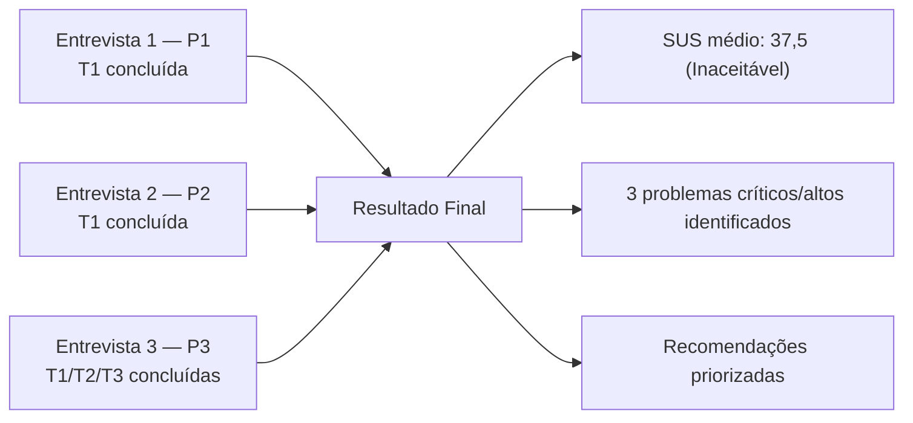

# Resultados do Teste de Usabilidade — Site Sabin

> **Método:** Think Aloud | **Tarefas:** T1 "Agende um exame de hemograma completo na unidade Ceilândia Centro." · T2 "Agende uma vacina de febre amarela para um dependente de 9 meses na unidade Águas Claras." · T3 "Veja as orientações de preparo para um check-up executivo."
> **Participantes:** 3 estudantes de Engenharia de Software (ver [Persona do Participante](persona.md))
> **Data das sessões:** T1 com P1/P2 em 24/06/2026 — demais sessões/tarefas **pendentes**
> **Avaliador(es):** Gustavo Xavier Evangelista, Lucas Andrade Zanetti

!!! warning "Status de coleta"
    **P1 e P2:** apenas a Tarefa 1 (agendamento). **P3:** as **3 tarefas** (T1, T2 e T3) — ver [seção 4](#4-resultado-entrevista-3-p3). Ainda faltam T2 e T3 com P1 e P2.

    **Não foi possível realizar as três tarefas com todos os participantes** por dificuldade de conciliar agenda/horário com os usuários — com P1 e P2 só foi viável executar a **Tarefa 1**. Ainda assim, **a realização da Tarefa 1 com eles contribui para a análise do teste de usabilidade**, pois permite comparar o fluxo de agendamento entre os participantes e reforça os problemas identificados.

    Os agregados abaixo já incluem os **3 participantes** onde há dado comparável: **T1** e **SUS** estão em **n=3** (P1, P2, P3); **T2 e T3** seguem em **n=1** (apenas P3). Caso T2/T3 sejam repetidas com P1 e P2, recalcular essas duas tarefas.

---

## Visão Geral

<div class="grid cards" markdown>

-   **3** participantes recrutados

    ---

    Estudantes de Engenharia de Software — ver [critérios de inclusão](planejamento.md#2-perfil-dos-participantes)

-   **1 / 3** tarefas concluídas

    ---

    Só a T1 foi aplicada aos 3 participantes; T2 e T3 apenas com P3

-   <span class="badge" style="background:#c62828;color:#fff;">SUS médio 37,5</span>

    ---

    Classificação **Inaceitável** (n=3 — P1, P2, P3)

-   **83,3%** de eficácia na T1

    ---

    P1 e P2 sem ajuda; P3 com ajuda do avaliador (n=3)

</div>



---

## 1. Resumo Quantitativo por Participante

| Participante | T1 ✓? | T1 (s) | T2 ✓? | T2 (s) | T3 ✓? | T3 (s) | SUS |
|---|---|---|---|---|---|---|---|
| P1 | ☑ Sim, sem ajuda | 240 | — | — | — | — | 42,5 |
| P2 | ☑ Sim, sem ajuda | 215 | — | — | — | — | 37,5 |
| P3 | ☑ Sim, com ajuda | 285 | ☑ Sim, com ajuda | 190 | ☑ Sim, sem ajuda | 45 | 32,5 |
| **Média (T1, n=3)** | — | 247 | — | — | — | — | 37,5 |

> **Médias recalculadas para n=3 na T1 e no SUS** (P1, P2, P3). As tarefas **T2 e T3** seguem em **n=1** (apenas P3, ver [seção 4](#4-resultado-entrevista-3-p3)) — recalcular se forem repetidas com P1 e P2.

### Taxa de conclusão da tarefa (T1, n=3)

`(1,0 [P1] + 1,0 [P2] + 0,5 [P3]) ÷ 3 = 83,3%`

> T2 e T3 seguem em n=1 (apenas P3). Incluir P1 e P2 nessas tarefas assim que as sessões restantes forem realizadas.

---

## 2. Resultado — Entrevista 1 (P1)

<div class="grid cards" markdown>

-   **Tempo (T1)** · 240s (4min)

-   **Conclusão** · <span class="badge" style="background:#2e7d32;color:#fff;">Sem ajuda</span>

-   **SUS** · <span class="badge" style="background:#c62828;color:#fff;">42,5 — Inaceitável</span>

</div>

**Perfil:** 20 anos, estudante de Engenharia de Software. Usa internet diariamente, alto letramento digital. Já usou os serviços do Sabin, mas nunca realizou agendamentos pelo site.

### Evidência em vídeo

<div class="video-wrapper" markdown>
<iframe src="https://www.youtube.com/embed/pH2DjBRNKGs" title="Gravação da Entrevista 1 — Teste de Usabilidade Sabin" allow="accelerometer; autoplay; clipboard-write; encrypted-media; gyroscope; picture-in-picture; web-share" referrerpolicy="strict-origin-when-secure" allowfullscreen></iframe>
</div>

[Assistir no YouTube ↗](https://youtu.be/pH2DjBRNKGs)

=== "Tarefa 1 — Agendamento (concluída)"

    ```mermaid
    flowchart LR
        A[Menu três barras] --> B[Exames laboratoriais]
        B --> C[Preparo de exames]
        C --> D[Serviços digitais]
        D --> E[Unidades]
        E --> F[Compra online]
        F --> G["Busca: hemograma completo"]
        G --> H[Comprar agora]
        H --> I[Prosseguir com a compra]
        I --> J[Nossas unidades]
        J --> K[Ceilândia]
        K --> L[Ceilândia Centro]
    ```

    | Campo | Registro |
    |---|---|
    | Verbalizações marcantes (citações literais) | "Eu achei bem complicado. Os nomes não eram o que eu estava esperando [...] tive que entrar em várias outras páginas para conseguir achar esse hemograma completo que não estava onde eu estava esperando, que seria lá na parte de exames." / "Eu senti falta também na questão da data" |
    | Erros / desvios observados | Procurou o agendamento em abas informativas ("Exames laboratoriais", "Preparo de exames", "Serviços digitais", "Solicitação de serviço domiciliar") antes de ir para "Compra online". |
    | Onde travou ou hesitou | Hesitou ao não encontrar a opção de agendamento diretamente na aba de "Exames". Sentiu falta de um campo para selecionar a data do exame. |
    | Observações do avaliador | O participante explorou grande parte do menu principal tentando encontrar a opção correta, demonstrando que a taxonomia do menu não está alinhada com as expectativas (esperava achar agendamento em "Exames" e não em "Compra online"). |

=== "Tarefa 2 — Vacina febre amarela (Águas Claras)"

    !!! info "Pendente"
        Sessão ainda não realizada.

    | Campo | Registro |
    |---|---|
    | Caminho percorrido | |
    | Verbalizações marcantes | |
    | Erros / desvios | |
    | Onde travou ou hesitou | |
    | Observações do avaliador | |

=== "Tarefa 3 — Preparo check-up executivo"

    !!! info "Pendente"
        Sessão ainda não realizada.

    | Campo | Registro |
    |---|---|
    | Caminho percorrido | |
    | Verbalizações marcantes | |
    | Erros / desvios | |
    | Onde travou ou hesitou | |
    | Observações do avaliador | |

**Respostas às perguntas pós-tarefa:** SUS: 42,5 (Inaceitável) — perguntas abertas pendentes de registro.

---

## 3. Resultado — Entrevista 2 (P2)

<div class="grid cards" markdown>

-   **Tempo (T1)** · 195s (3min15s)

-   **Conclusão** · <span class="badge" style="background:#2e7d32;color:#fff;">Sem ajuda</span>

-   **SUS** · <span class="badge" style="background:#c62828;color:#fff;">37,5 — Inaceitável</span>

</div>

**Perfil:** 19 anos, estudante de Engenharia de Software. Usa celular como dispositivo principal. Alto letramento digital. Já fez exames na unidade Ceilândia Centro.

### Evidência em vídeo

<div class="video-wrapper" markdown>
<iframe src="https://www.youtube.com/embed/T6je8iKDG30" title="Gravação da Entrevista 2 — Teste de Usabilidade Sabin" allow="accelerometer; autoplay; clipboard-write; encrypted-media; gyroscope; picture-in-picture; web-share" referrerpolicy="strict-origin-when-secure" allowfullscreen></iframe>
</div>

[Assistir no YouTube ↗](https://youtu.be/T6je8iKDG30)

=== "Tarefa 1 — Agendamento (concluída)"

    ```mermaid
    flowchart LR
        A[Página inicial] --> B[Menu principal]
        B --> C[Abas informativas diversas]
        C --> D[Volta à página inicial]
        D --> E["Procure seu exame: hemograma completo"]
        E --> F["Agendar o exame -> cai em atendimento móvel"]
        F --> G[Voltar navegador]
        G --> H[Refaz a busca]
        H --> I[Comprar online]
        I --> J[Comprar]
        J --> K[Termos de uso]
        K --> L[Nossas unidades]
        L --> M[Ceilândia]
        M --> N[Ceilândia Centro]

        style F stroke:#c62828,stroke-width:2px
    ```

    | Campo | Registro |
    |---|---|
    | Verbalizações marcantes (citações literais) | "Achei os termos um pouco confusos... a primeira opção é agendar exame, mas ele vai para um local que não faz sentido que é o atendimento domiciliar. A opção certa é comprar exame, que pra mim faria mais sentido você agendar, né?" / "Senti falta de não ter como selecionar um local e uma data" |
    | Erros / desvios observados | Clicou em "agendar o exame" dentro da busca, mas foi direcionado para "atendimento domiciliar/móvel". Não encontrou botão de voltar no site, usando o do navegador e perdendo o preenchimento da busca. |
    | Onde travou ou hesitou | Confundiu a nomenclatura "comprar online" (que é o caminho correto) com "agendar exame" (que levava ao serviço móvel). |
    | Observações do avaliador | O participante também evidenciou um problema grave de taxonomia: "comprar" não é associado mentalmente a "agendar". Além disso, o botão de agendar no exame redireciona para um tipo de serviço restrito, frustrando o fluxo. |

=== "Tarefa 2 — Vacina febre amarela (Águas Claras)"

    !!! info "Pendente"
        Sessão ainda não realizada.

    | Campo | Registro |
    |---|---|
    | Caminho percorrido | |
    | Verbalizações marcantes | |
    | Erros / desvios | |
    | Onde travou ou hesitou | |
    | Observações do avaliador | |

=== "Tarefa 3 — Preparo check-up executivo"

    !!! info "Pendente"
        Sessão ainda não realizada.

    | Campo | Registro |
    |---|---|
    | Caminho percorrido | |
    | Verbalizações marcantes | |
    | Erros / desvios | |
    | Onde travou ou hesitou | |
    | Observações do avaliador | |

**Respostas às perguntas pós-tarefa:** SUS: 37,5 (Inaceitável) — perguntas abertas pendentes de registro.

---

## 4. Resultado — Entrevista 3 (P3)

<div class="grid cards" markdown>

-   **Tempo somado nas tarefas** · ~8min40s (T1 285s · T2 190s · T3 45s) — sessão de 10min22s

-   **Conclusão** · <span class="badge" style="background:#2e7d32;color:#fff;">T3 sem ajuda</span> <span class="badge" style="background:#e65100;color:#fff;">T1 e T2 com ajuda</span>

-   **SUS** · <span class="badge" style="background:#c62828;color:#fff;">32,5 — Inaceitável</span>

</div>

!!! note "Sessão diferente de P1 e P2"
    Esta foi a **única sessão até agora em que as 3 tarefas foram aplicadas**. As tarefas seguem a ordem do roteiro (T1, T2, T3).

**Perfil:** 20 anos, estudante de Engenharia de Software, sexo feminino (conforme [critérios de recrutamento](persona.md)). Dispositivo principal e relação prévia com o Sabin não foram verbalizados na sessão — complementar pela ficha de triagem.

### Evidência em vídeo

<div class="video-wrapper" markdown>
<iframe src="https://www.youtube.com/embed/Yy9u99nBeJw" title="Gravação da Entrevista 3 — Teste de Usabilidade Sabin" allow="accelerometer; autoplay; clipboard-write; encrypted-media; gyroscope; picture-in-picture; web-share" referrerpolicy="strict-origin-when-secure" allowfullscreen></iframe>
</div>

[Assistir no YouTube ↗](https://youtu.be/Yy9u99nBeJw)

=== "Tarefa 1 — Agendamento (com ajuda)"

    ```mermaid
    flowchart LR
        A["Botão 'agendamento'"] --> B["Pré-cadastro de exames (unidade digital)"]
        B --> C["Solicitação de exames"]
        C --> D["Conteúdo de apoio — não achou"]
        D --> E["Serviços digitais"]
        E --> F["Atendimento domiciliar — rejeitou"]
        F --> G["Agilizar exames de análises clínicas"]
        G --> H["Menu ☰ — 1ª dica do avaliador"]
        H --> I["Exames laboratoriais — não tinha"]
        I --> J["Compre online — 2ª dica"]
        J --> K["Busca: hemograma completo"]
        K --> L["Cai em 'atendimento móvel'"]
        L --> M["'Comprar' exame → avança"]

        style D stroke:#c62828,stroke-width:2px
        style L stroke:#c62828,stroke-width:2px
    ```

    | Campo | Registro |
    |---|---|
    | Verbalizações marcantes (citações literais) | "Vou apertar no botão de agendamento, que faz sentido." / "Tô procurando onde que eu vou agendar um exame [...] desci até a parte de conteúdo de apoio e não achei." / "Acho que não é aqui, né, mano? Não tô achando." / "Não consigo voltar pra parte inicial." / "Isso aqui é um tipo de atendimento móvel, não é isso? E como é que eu vou agendar?" / "Ah, tá. Então eu tenho que comprar meu exame aqui primeiro." |
    | Erros / desvios observados | Procurou o agendamento em "pré-cadastro / unidade digital", "solicitação de exames", "conteúdo de apoio", "atendimento domiciliar" e "agilizar exames de análises clínicas" antes do caminho correto. Só chegou ao fluxo certo após **duas dicas do avaliador** (abrir o menu ☰ e, depois, escolher "Compre online"). |
    | Onde travou ou hesitou | Não encontrava a opção de agendar; ficou presa numa tela de solicitação de serviço sem conseguir voltar à página inicial. Estranhou que "agendar" caísse no **atendimento móvel** e que fosse preciso "comprar" o exame para marcá-lo. Não houve etapa de data/horário. |
    | Observações do avaliador | Tarefa concluída **com ajuda** (2 intervenções), em ~4min45s (285 s). Participante visivelmente perdida ("fiquei bem perdida"). Reforça **TU-01** (nomenclatura "comprar" ≠ "agendar") e **TU-02** (redirecionamento ao atendimento móvel sem aviso). |

=== "Tarefa 2 — Vacina febre amarela (Águas Claras)"

    > Dependente de 9 meses.

    ```mermaid
    flowchart LR
        A["Menu ☰ → Vacinas"] --> B["Vacinação na unidade / Agendar na unidade"]
        B --> C["Águas Claras"]
        C --> D["Tela da unidade — não achou agendamento"]
        D --> E["Volta → Compre online"]
        E --> F["'Muita informação' — filtro de crianças"]
        F --> G["Não acha onde pesquisar — dica do avaliador"]
        G --> H["Menu ☰ → Vacinas infantis (9 meses)"]
        H --> I["Vacina de febre amarela"]
        I --> J["Águas Claras (Shopping Metrópole)"]

        style D stroke:#c62828,stroke-width:2px
        style F stroke:#c62828,stroke-width:2px
    ```

    | Campo | Registro |
    |---|---|
    | Verbalizações marcantes (citações literais) | "Estou na tela da unidade de Águas Claras e não achei a parte de agendamento." / "Meu Deus, muita informação." / "Eu queria pesquisar a vacina de febre amarela, mas não sei como faz isso." / "Vou clicar em vacinas infantis porque meu filho tem 9 meses." |
    | Erros / desvios observados | Tentou agendar pela página da unidade (Águas Claras) e pelo "Compre online" antes de achar o caminho por **Vacinas infantis**. Precisou de **uma dica do avaliador** (usar o menu ☰). |
    | Onde travou ou hesitou | Sobrecarga de informação na listagem de vacinas; não encontrava campo de busca. Estranheza de que "compra online" levasse ao agendamento de vacina infantil. |
    | Observações do avaliador | Tarefa concluída **com ajuda** (1 intervenção), em ~3min10s (190 s). O mesmo problema de taxonomia da T1 se repete no fluxo de vacinas — confirma que **TU-01** vale também para vacinação. |

=== "Tarefa 3 — Preparo check-up executivo (sem ajuda)"

    > Único fluxo tranquilo da sessão.

    ```mermaid
    flowchart LR
        A["Menu ☰ → Exames"] --> B["Checkup executivo"]
        B --> C["Rola a página"]
        C --> D["Orientações de preparo — 'Achei'"]

        style D stroke:#2e7d32,stroke-width:2px
    ```

    | Campo | Registro |
    |---|---|
    | Verbalizações marcantes (citações literais) | "Vou clicar em exames [...] vou clicar em checkup executivo." / "Tô descendo a tela aqui para achar a orientação." / "Orientações de preparo. Achei." |
    | Erros / desvios observados | Nenhum desvio relevante. Caminho direto pelo menu ☰. |
    | Onde travou ou hesitou | Não travou. Pequena dúvida se a seção de orientações já estava expandida ou costuma vir recolhida. |
    | Observações do avaliador | Tarefa concluída **sem ajuda**, em 45 s. No feedback final: *"foi bem mais fácil e mais intuitivo de encontrar as orientações"*. Contrasta fortemente com T1/T2. |

**Respostas às perguntas pós-tarefa (feedback final da participante):**

- **T1 (hemograma):** *"Foi bem difícil de encontrar o lugar certo e eu fiquei bem perdida."*
- **T3 (preparo do check-up):** *"Foi bem mais fácil e mais intuitivo de encontrar as orientações."*
- **T2 (vacina febre amarela):** *"Também foi bem difícil de achar o lugar certo, porque eu não imaginaria que fazer uma compra online me levaria a agendar uma vacina pra criança."*

!!! note "Pontuação SUS — detalhamento por item"
    Respostas da participante ao questionário SUS (escala 1–5), com a observação correspondente a cada item:

    | # | Afirmação (SUS) | Resposta (1–5) | Observação |
    |---|---|---|---|
    | 1 | Gostaria de usar o site com frequência | 1 | Frustração no agendamento; só a T3 foi tranquila |
    | 2 | Site desnecessariamente complexo | 4 | "Muita informação"; perdeu-se em várias telas |
    | 3 | Site fácil de usar | 2 | Difícil em 2 das 3 tarefas |
    | 4 | Precisaria de suporte técnico | 2 | Precisou de dicas do avaliador, mas é usuária fluente |
    | 5 | Funções bem integradas | 2 | "Comprar" para agendar exame/vacina quebra o modelo mental |
    | 6 | Muita inconsistência | 4 | "Agendar" leva ao atendimento móvel; nomenclatura confusa |
    | 7 | Maioria aprenderia rapidamente | 2 | Mesmo sendo da área de TI, ficou perdida |
    | 8 | Site muito difícil de usar | 4 | Difícil em T1 e T2 |
    | 9 | Senti-me confiante | 2 | Concluiu tudo e agiu com confiança na T3 |
    | 10 | Precisei aprender muita coisa | 2 | Mais questão de achabilidade do que de aprendizado |

    **Cálculo:** ímpares (1,3,5,7,9) = (1+2+2+2+2) − 5 = **4** · pares (2,4,6,8,10) = 25 − (4+2+4+4+2) = **9** · (4 + 9) × 2,5 = **32,5 pontos** → <span class="badge" style="background:#c62828;color:#fff;">Inaceitável (&lt;50)</span>

---

## 5. Resultado Final

> Síntese consolidada das 3 entrevistas. **T1 e SUS** refletem **n=3** (P1, P2, P3); **T2 e T3** refletem **n=1** (apenas P3) e devem ser recalculadas se repetidas com P1 e P2.

### 5.1 SUS (System Usability Scale)

> Use o cálculo descrito em [Questionário SUS](questionario-sus.md) para cada participante. O SUS é aplicado uma vez por participante, ao final das 3 tarefas — não por tarefa.

| Participante | Pontuação SUS | Classificação |
|---|---|---|
| P1 | 42,5 | <span class="badge" style="background:#c62828;color:#fff;">Inaceitável (&lt;50)</span> |
| P2 | 37,5 | <span class="badge" style="background:#c62828;color:#fff;">Inaceitável (&lt;50)</span> |
| P3 | 32,5 | <span class="badge" style="background:#c62828;color:#fff;">Inaceitável (&lt;50)</span> |
| **Média (n=3)** | 37,5 | <span class="badge" style="background:#c62828;color:#fff;">Inaceitável (&lt;50)</span> |

### 5.2 Problemas de Usabilidade Identificados

> Liste cada problema observado em pelo menos 1 sessão. Use a mesma escala de severidade da [Avaliação Heurística](../avaliacao-heuristica/index.md) para permitir comparação cruzada entre as duas frentes de avaliação. Os itens abaixo vêm de T1 (P1, P2) — adicionar achados de T2/T3 conforme forem coletados.

| ID | Problema observado | Participante(s) afetado(s) | Severidade | Heurística/critério relacionado | Evidência |
|---|---|---|---|---|---|
| TU-01 | Nomenclatura ambígua ("Compra online" vs "Agendar exame" vs "Serviços digitais") não corresponde ao modelo mental do usuário | P1, P2 | <span class="badge" style="background:#c62828;color:#fff;">Crítico</span> | Correspondência com o mundo real (H2) | P1 procurou exames em várias abas informativas. P2 apontou que "comprar não faz sentido, deveria ser agendar". |
| TU-02 | Botão "Agendar o exame" no resultado da pesquisa direciona para atendimento móvel sem aviso prévio e sem opção clara de voltar | P2 | <span class="badge" style="background:#e65100;color:#fff;">Alto</span> | Controle e liberdade (H3), Prevenção de erros (H5) | P2 caiu na página de atendimento móvel, teve que usar o botão de voltar do navegador e perdeu a busca. |
| TU-03 | Falta de etapa para seleção de data e horário do exame no fluxo | P1, P2 | <span class="badge" style="background:#c62828;color:#fff;">Crítico</span> | Visibilidade do status do sistema (H1) | Ambos os participantes reclamaram explicitamente que não lhes foi dada a opção de escolher a data do agendamento. |
| TU-04 | *(pendente — preencher após T2)* | | | | |
| TU-05 | *(pendente — preencher após T3)* | | | | |

### 5.3 Cruzamento com Avaliação Heurística

> Indique quais problemas previstos na [Avaliação Heurística](../avaliacao-heuristica/index.md) (HE-01 a HE-21) foram **confirmados**, **não observados** ou **não testados** nesta rodada empírica.
>
> Cobertura por tarefa: **T1** → H3, H5, H6, H7, H9 (agendamento) · **T2** → H2, H3, H5, H9 (agendamento de vacina) · **T3** → H1, H6, H7 (preparo de check-up).

| ID Heurística | Problema previsto | Confirmado no teste? | Observação |
|---|---|---|---|
| H2 / H4 | Problemas de taxonomia e nomenclatura no menu principal | Confirmado (T1) | "Compra online" não é reconhecido como agendamento de exames. |
| H3 / H5 | Falta de controle/saída clara ao entrar em fluxos específicos (ex: atendimento móvel) | Confirmado (T1) | O usuário precisou usar o "Voltar" do navegador e perdeu sua pesquisa. |
| H1 | Ausência de opções básicas de agendamento (ex: data e hora) | Confirmado (T1) | A expectativa do agendamento não é cumprida ao final do fluxo. |

### 5.4 Síntese e Recomendações

**Principais achados (T1 e SUS com n=3; T2/T3 com n=1 — apenas P3):**

- A taxonomia do site (como o uso do termo "Comprar online" em vez de "Agendar") confunde os usuários e atrasa a conclusão das tarefas, indo contra o modelo mental dos pacientes.
- O redirecionamento surpresa para o serviço de atendimento móvel prejudica a fluidez, fazendo o usuário pensar que errou o caminho ou que não pode agendar em uma unidade física.
- A ausência de um calendário para marcação de data frustra os usuários no final da tarefa, passando a impressão de que o processo está incompleto.
- O SUS médio de 37,5 (Inaceitável, n=3) reflete um alto custo cognitivo e insatisfação com a interface — a aprofundar nas tarefas T2/T3 com mais participantes (hoje em n=1).

**Recomendações priorizadas (com base em T1):**

<div class="grid cards" markdown>

-   <span class="badge" style="background:#c62828;color:#fff;">Imediata</span> — TU-03

    ---

    Integrar a seleção de data e horário como uma etapa clara dentro do fluxo de marcação/carrinho antes da confirmação.

-   <span class="badge" style="background:#c62828;color:#fff;">Imediata</span> — TU-01

    ---

    Refatorar os rótulos do menu. Trocar termos como "Compra online" para "Agendamento de Exames" para ficar mais intuitivo.

-   <span class="badge" style="background:#e65100;color:#fff;">Alta</span> — TU-02

    ---

    Adicionar um modal ou opção de escolha (Unidade Física vs Domiciliar) antes de jogar o usuário no formulário de atendimento móvel.

</div>

**Limitações da rodada:**

- Amostra pequena (3 participantes) e homogênea (estudantes de Engenharia de Software da mesma faculdade) — ver nota em [Persona do Participante](persona.md#1-persona-primaria). Resultados são indicativos, não conclusivos sobre a usabilidade geral do site para o público real do Sabin (idosos, baixa literacia digital, etc.).
- Nenhuma das 3 tarefas exige login — o portal de laudos (área autenticada) não é coberto por esta rodada.
- **Não foi possível concluir as três tarefas com todos os participantes** por dificuldade de conciliar tempo/agenda com os usuários: com P1 e P2 só foi viável a **Tarefa 1**, enquanto P3 realizou as três (T1, T2 e T3). Mesmo parcial, a execução da Tarefa 1 com P1 e P2 **contribui para a análise do teste de usabilidade**, ao permitir comparar o fluxo de agendamento entre os participantes. Para uma síntese final, aguardam-se T2 (vacina febre amarela) e T3 (preparo de check-up) com P1 e P2.

---

## Referências

> NIELSEN, Jakob. *Usability Engineering*. Academic Press, 1993.

> RUBIN, Jeffrey; CHISNELL, Dana. *Handbook of Usability Testing*. 2ª ed. Wiley, 2008.

> BROOKE, John. SUS: A "Quick and Dirty" Usability Scale. In: JORDAN, P. W. et al. (eds.). *Usability Evaluation in Industry*. Taylor & Francis, 1996. p. 189–194.
