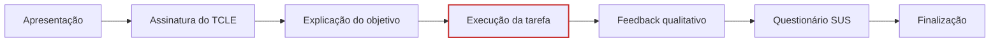

# Teste Piloto

> Validação do roteiro do [Planejamento do Teste de Usabilidade](../planejamento.md) antes das 3 sessões oficiais — ver [Cronograma](../planejamento.md#7-cronograma).

## Objetivo
O teste piloto foi conduzido com o intuito de validar o planejamento do Teste de Usabilidade (roteiro, clareza da tarefa, funcionamento da gravação e tempo de execução) antes da aplicação com os participantes reais.

Para simular o teste real com a maior veracidade possível, o entrevistado escolhido foi um membro da equipe que ainda não conhecia o fluxo de execução da tarefa no site do Sabin.

-   **Tempo** · 6 minutos

-   **Tarefa** · T1 (agendamento de hemograma)

-   Sinal verde para as sessões oficiais

## Participantes do Piloto
* **Entrevistador:** Lucas Andrade Zanetti
* **Entrevistado:** Tiago Santos Bittencourt (Membro da equipe)

## Evidência em vídeo

Para permitir uma análise completa, o teste piloto foi registrado de duas formas:

### 1. Gravação de Tela
Captura a interação direta do participante com a interface do sistema, permitindo visualizar o caminho percorrido, cliques e navegação.

<iframe src="https://www.youtube.com/embed/QRMqrP44hD0" title="Gravação do Teste Piloto — Teste de Usabilidade Sabin" allow="accelerometer; autoplay; clipboard-write; encrypted-media; gyroscope; picture-in-picture; web-share" referrerpolicy="strict-origin-when-secure" allowfullscreen></iframe>

[Assistir à gravação da tela no YouTube ↗](https://www.youtube.com/watch?v=QRMqrP44hD0)

### 2. Gravação do Ambiente
Mostra o contexto da sessão, enquadrando o participante (entrevistado), o entrevistador e o anotador. Este vídeo é fundamental para analisar a linguagem corporal, as expressões faciais e a dinâmica entre o usuário e os avaliadores.

**Link para o vídeo:**
[Assistir à gravação do ambiente no YouTube](https://www.youtube.com/watch?v=zCOnzdcWTNk)

## Resumo da Sessão

* **Tarefa:** Agendar um exame de hemograma completo na unidade Ceilândia Centro.
* **Trajetória do Teste:** Apresentação → Assinatura do TCLE → Explicação do objetivo → Execução da tarefa → Feedback qualitativo → Questionário SUS → Finalização.
* **Tempo de Duração:** 6 minutos

## Principais Observações
* **Desempenho na Tarefa:** O participante encontrou grandes dificuldades na navegação inicial, explorando abas como "Exames laboratoriais" e "Preparo de exames", que continham apenas informações em vez do agendamento.
* **Necessidade de Ajuda:** Devido à desorientação, o avaliador precisou dar dicas ("Comece por aqui mesmo... dentro de exames") e ajudar a sair da rota errada de atendimento domiciliar.
* **Nomenclatura (Taxonomia):** O participante confirmou um problema estrutural no site. Ele evitou a opção "Compre online" porque, segundo ele, "comprar não é intuitivo para ser um agendamento. Comprar para mim é comprar um produto, não agendar uma retirada de sangue."
* **Avaliação Geral do Participante:** Quando questionado se foi fácil, o participante respondeu: "Muito difícil. Nada intuitivo."

## Conclusões do Piloto
A execução com o Tiago validou o roteiro e a eficácia da técnica de *Think Aloud*. A tarefa de agendamento mostrou-se suficientemente complexa para revelar falhas graves de taxonomia (Agendar vs. Comprar) e de fluxo (Atendimento Móvel vs. Unidade), problemas que se confirmaram posteriormente nos testes reais (P1 e P2). O piloto deu o sinal verde para o início das entrevistas oficiais.

---

Ver os [Resultados das entrevistas oficiais](../resultados.md) para a continuação do teste.