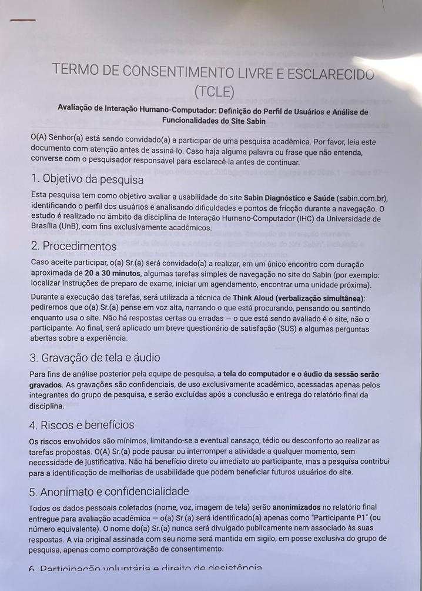
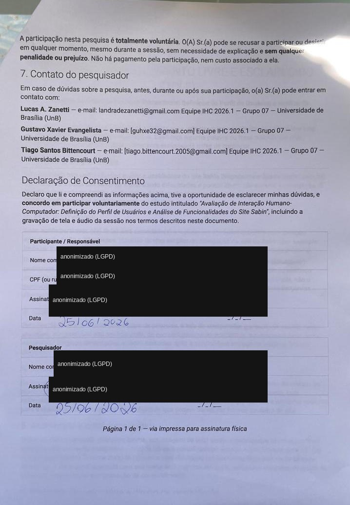

# Relatório Técnico — Teste de Usabilidade do Portal Sabin

> **Disciplina:** Interação Humano-Computador (IHC) — 2026.1
> **Instituição:** Universidade de Brasília (UnB)
> **Equipe:** Grupo 07
> **Site avaliado:** [sabin.com.br](https://www.sabin.com.br)
> **Método:** Think Aloud (Nielsen, 1993) + System Usability Scale (Brooke, 1996)
> **Referência da tarefa:** Tg_IHC-03
> **Data das sessões:** Junho/2026
> **Versão:** 1.0
> **Participantes:** P1, P2 e P3 (anonimizados conforme TCLE)

---

## Sumário

1. [Introdução](#1-introducao)
2. [Perfil do Usuário](#2-perfil-do-usuario)
3. [Metodologia e Roteiro](#3-metodologia-e-roteiro)
4. [Resultados](#4-resultados)
5. [Achados de Acessibilidade (WCAG 2.2)](#5-achados-de-acessibilidade-wcag-22)
6. [Recomendações Priorizadas](#6-recomendacoes-priorizadas)
7. [Reflexão Final](#7-reflexao-final)
8. [Referências](#referencias)
9. [Anexos](#anexos)

---

## Resumo Executivo

Mesmo com participantes de **alto letramento digital**, o fluxo de agendamento do
portal Sabin revelou-se confuso e pouco intuitivo. O termo **"Compra online"** não é
reconhecido como "agendar exame", o botão **"Agendar"** desvia o usuário para o
atendimento domiciliar sem aviso, e **não há etapa de escolha de data**. O resultado
é um **SUS médio de 37,5** (faixa "Inaceitável"). Em contraste, a tarefa de consultar
o preparo de um check-up (T3) foi resolvida sem dificuldade em ~45 s — confirmando que
o problema está **concentrado no fluxo de agendamento**, não no site como um todo.

| Indicador | Valor |
|---|---|
| Participantes (usuários reais) | 3 (P1, P2, P3) |
| Tarefas avaliadas | 3 (agendar exame, agendar vacina, ver preparo) |
| Taxa de sucesso na T1 (agendamento de exame) | **83,3%** (n=3) |
| SUS médio | **37,5 — Inaceitável** (n=3) |
| Problemas críticos/altos identificados | 3 (TU-01, TU-02, TU-03) |

---

## 1. Introdução

### 1.1 Contexto

Este relatório documenta o **teste de usabilidade empírico** conduzido pelo Grupo 07 da
disciplina de Interação Humano-Computador (IHC 2026.1, UnB) sobre o **portal Sabin
Diagnóstico e Saúde** ([sabin.com.br](https://www.sabin.com.br)), um site real e público
de uma das maiores redes de medicina diagnóstica do Brasil. A avaliação dá continuidade
às frentes anteriores do grupo — a **avaliação heurística** (TG-02) e a **avaliação de
acessibilidade** — agora validando empiricamente, **com usuários reais**, os problemas
antes previstos apenas por inspeção especialista.

O portal concentra tarefas centrais do paciente: agendar exames, agendar vacinas, consultar
instruções de preparo, localizar unidades e acessar resultados. Esta rodada foca nas
**jornadas não autenticadas** (sem login), por serem as de maior alcance e as que qualquer
participante consegue executar até o fim sem barreira de acesso.

### 1.2 Objetivo do teste

Avaliar a qualidade de uso do portal Sabin sob a perspectiva de usuários reais,
identificando problemas que dificultam a realização de tarefas centrais. Especificamente,
o teste busca:

1. Mensurar a **eficácia** (taxa de sucesso/conclusão) das tarefas definidas;
2. Mensurar a **eficiência** (tempo médio por tarefa — *time-on-task*);
3. Identificar **erros e pontos de fricção** cometidos espontaneamente pelos participantes;
4. Aferir a **satisfação subjetiva** por meio do questionário SUS;
5. **Cruzar** os achados empíricos com os problemas previstos na avaliação heurística (TG-02).

### 1.3 Fundamentação metodológica

O estudo articula métodos consagrados de IHC. O protocolo **Think Aloud** (verbalização
simultânea) de **Nielsen (1993)** orienta a coleta qualitativa; o instrumento validado
**System Usability Scale (SUS)** de **Brooke (1996)** mensura a satisfação; e as métricas
de eficácia, eficiência e erros seguem a abordagem de **Rubin & Chisnell (2008)** para
condução e análise de testes de usabilidade. As referências bibliográficas completas estão
listadas na [seção de Referências](#referencias).

---

## 2. Perfil do Usuário

### 2.1 Persona primária — "Ana"

O público real do portal Sabin é amplo (pacientes de todas as idades, cuidadores, usuários
de convênio). Para esta rodada, definiu-se uma **persona primária** e critérios objetivos de
recrutamento, conforme orienta Krug (2014).

| Atributo | Descrição |
|---|---|
| **Nome / idade** | Ana, 20 anos |
| **Ocupação / escolaridade** | Estudante de Engenharia de Software (ensino superior em curso) |
| **Dispositivo principal** | Smartphone, com uso eventual de notebook |
| **Frequência de uso da internet** | Diária e intensa (estudo, redes sociais, apps de serviço) |
| **Letramento digital** | Alto — usuária avançada, rápida em identificar padrões de interface |
| **Experiência com sites de saúde** | Já fez exames de rotina e de sangue presencialmente; usa pouco o site |
| **Contexto de uso** | Quer agendar exames sem telefonar, conferir preparo e acessar resultados online |
| **Frustrações** | Pouca paciência para fluxos longos; abandona e liga para a central se travar por 1–2 min |

### 2.2 Participantes recrutados

Foram recrutados **3 participantes reais** que se encaixam na persona, nenhum deles colega
da disciplina nem envolvido na elaboração do roteiro. Critérios de exclusão aplicados:
vínculo com o Sabin ou concorrente; experiência profissional em UX/Design; condução prévia
de testes de usabilidade.

| Participante | Perfil (idade / escolaridade / uso de internet) | Experiência com sites de saúde |
|---|---|---|
| **P1** | 20 anos, estudante de Eng. de Software, uso diário de internet, alto letramento digital | Já fez exames presencialmente; **nunca agendou pelo site** |
| **P2** | 19 anos, estudante de Eng. de Software, usa o **celular** como dispositivo principal | Já fez exames na unidade **Ceilândia Centro** |
| **P3** | 20 anos, estudante de Eng. de Software (feminino), uso diário de internet | Conhece o Sabin; **uso pouco frequente** do site |

> **Contexto de uso (por que usam sites médicos):** os participantes representam usuários que
> recorrem ao portal para **agendar exames para si ou para familiares sem telefonar**, **conferir
> instruções de preparo** (jejum, restrições) antes de ir ao laboratório, **acessar resultados
> online** e **confirmar a unidade** mais conveniente.

### 2.3 Limitação de amostra

Os três participantes são estudantes de Engenharia de Software da mesma faculdade — amostra
**homogênea e tecnicamente fluente**. Problemas que afetam idosos, pessoas com baixa literacia
digital ou baixa visão podem **não** ter sido detectados nesta rodada. Os resultados são
**indicativos do fluxo**, não conclusivos sobre toda a base de usuários do Sabin. O fato de
até usuários fluentes terem encontrado dificuldades graves, porém, torna os achados ainda mais
relevantes: se a tarefa é difícil para quem domina tecnologia, tende a ser pior para o público
diverso real do laboratório.

---

## 3. Metodologia e Roteiro

### 3.1 Método: Think Aloud (Nielsen, 1993)

Adotou-se o protocolo **Think Aloud** (verbalização simultânea): durante cada tarefa, o
participante narra em voz alta o que pensa, procura, espera e o que o confunde. O avaliador
**não auxilia** durante as tarefas — salvo intervenção pontual registrada após travamento
prolongado — e responde a pedidos de ajuda com *"O que você tentaria fazer?"*. Cada sessão
seguiu um roteiro padronizado: boas-vindas e contextualização, tarefa de aquecimento, execução
das tarefas com verbalização, perguntas abertas pós-tarefa e questionário SUS.

| Item do procedimento | Especificação |
|---|---|
| **Modalidade** | Presencial, em ambiente controlado e silencioso |
| **Gravação** | Tela + áudio, mediante consentimento (TCLE assinado antes do início) |
| **Cronometragem** | Início na leitura completa da tarefa; fim na declaração do participante ou *timeout* de 5 min |
| **Desfecho registrado** | Sucesso sem ajuda / sucesso com ajuda / não concluiu |
| **Navegador** | Google Chrome atualizado, sem histórico/login do site, resolução 1366×768 |
| **Ética** | TCLE com objetivo, aviso de gravação, anonimato (P1–P3) e direito de desistência |

### 3.2 Tarefas e cenários

Foram redigidas **três tarefas representativas**, formuladas como **cenários de uso** (e não
como instruções literais da interface), todas **sem necessidade de login** e em fluxos distintos
do site.

> **Nota de escopo:** o template de entregáveis da disciplina sugere "5 tarefas"; a equipe
> definiu, no [planejamento](../docs/ihc-sabin/teste-usabilidade/planejamento.md), **3 tarefas
> representativas** que cobrem fluxos diferentes (exame, vacina, conteúdo informativo) e
> heurísticas distintas, suficientes para expor os problemas centrais sem fadigar o participante.

**Tarefa 1 — Agendamento de exame**
> *"Agende um exame de **hemograma completo** na unidade **Ceilândia Centro**."*
> **Sucesso:** chegar a uma tela do fluxo de agendamento com o exame e a unidade corretos
> selecionados. **Falha notável:** não localizar o exame/unidade ou cair em erro 404.

**Tarefa 2 — Agendamento de vacina (dependente)**
> *"Você quer agendar uma vacina de **febre amarela** no site, para o seu **filho de 9 meses**,
> na unidade **Águas Claras**."*
> **Sucesso:** chegar ao fluxo com a vacina e a unidade selecionados. **Observar:** se o site
> comunica claramente a restrição de idade (9 meses).

**Tarefa 3 — Busca de informação**
> *"Você quer ver as **orientações de preparo** para um agendamento de **check-up executivo**."*
> **Sucesso:** chegar à página do check-up executivo e indicar verbalmente as orientações de preparo.

Antes do teste, a equipe mapeou hipóteses de fricção para cada fluxo (storyboards), a serem
confirmadas ou refutadas pelas sessões reais:

*Figura 1. Storyboard de hipóteses de fricção da Tarefa 1 (agendamento de hemograma).*

*Figura 2. Storyboard de hipóteses de fricção da Tarefa 2 (vacina de febre amarela para dependente).*

*Figura 3. Storyboard de hipóteses de fricção da Tarefa 3 (preparo de check-up executivo).*

### 3.3 Métricas coletadas

| Métrica | Tipo | Instrumento / critério |
|---|---|---|
| **Taxa de sucesso (eficácia)** | Quantitativa | Planilha de observação: sem ajuda = 1,0 · com ajuda = 0,5 · não concluiu = 0 |
| **Tempo por tarefa (eficiência)** | Quantitativa | Cronômetro (início: leitura da tarefa; fim: declaração do participante ou *timeout* de 5 min) |
| **Número de erros** | Quantitativa | Contagem de cliques/seções erradas, redirecionamentos indevidos e voltas ao início |
| **Verbalizações espontâneas** | Qualitativa | Gravação de áudio + transcrição seletiva (*Think Aloud*) |
| **Satisfação subjetiva (SUS)** | Quantitativa | Questionário SUS (10 itens, escala 1–5), aplicado uma vez ao final da sessão |
| **Observações do avaliador** | Qualitativa | Notas livres durante a sessão |

> **Cobertura da coleta:** a **Tarefa 1** foi aplicada aos **3 participantes** (n=3); as
> **Tarefas 2 e 3**, apenas a **P3** (n=1), por dificuldade de conciliar agenda com P1 e P2. O
> questionário **SUS** foi respondido pelos **3 participantes** (n=3). As métricas a seguir
> deixam explícito o tamanho da amostra de cada tarefa.

---

## 4. Resultados

### 4.1 Resumo por participante e tarefa

| Part. | T1 — hemograma | T2 — vacina | T3 — preparo | SUS |
|---|---|---|---|---|
| **P1** | ✅ Sem ajuda · 240 s | — | — | 42,5 |
| **P2** | ✅ Sem ajuda · 195 s | — | — | 37,5 |
| **P3** | ⚠️ Com ajuda · 285 s | ⚠️ Com ajuda · 190 s | ✅ Sem ajuda · 45 s | 32,5 |

> Legenda: ✅ concluiu sem ajuda · ⚠️ concluiu com ajuda do avaliador · — tarefa não aplicada ao participante.
>
> **Duração total das sessões:** P1 — 6 min 55 s · P2 — 6 min 35 s · P3 — 10 min 22 s
> (média ≈ 8 min). As sessões de P1 e P2 foram mais curtas por cobrirem apenas a T1; a de P3
> incluiu as três tarefas.

### 4.2 Taxa de sucesso por tarefa (eficácia)

A taxa de sucesso pondera o desfecho: sucesso sem ajuda = 1,0; sucesso com ajuda = 0,5;
não concluiu = 0. A taxa é a média ponderada dividida pelo nº de participantes da tarefa.

| Tarefa | Cálculo | Taxa de sucesso |
|---|---|---|
| **T1 — Agendar hemograma** (n=3) | (1,0 + 1,0 + 0,5) ÷ 3 | **83,3%** |
| **T2 — Agendar vacina** (n=1) | 0,5 ÷ 1 | **50,0%** |
| **T3 — Ver preparo** (n=1) | 1,0 ÷ 1 | **100%** |

Embora a T1 registre 83,3% de eficácia, a leitura cruzada é reveladora: a tarefa de
**busca de informação (T3)** teve **100% e 45 s**, enquanto as tarefas de **agendamento
(T1/T2)** exigiram muito mais tempo e ajuda. O gargalo está claramente no **fluxo de
agendamento**, não na consulta de conteúdo.

### 4.3 Tempo médio por tarefa (eficiência)

| Tarefa | Tempos individuais | Tempo médio |
|---|---|---|
| **T1** (n=3) | 240 s · 195 s · 285 s | **240 s** (= 4 min 00 s) |
| **T2** (n=1) | 190 s | **190 s** (≈ 3 min 10 s) |
| **T3** (n=1) | 45 s | **45 s** |

O contraste de eficiência é eloquente: encontrar uma informação (T3) levou 45 s, enquanto
iniciar um agendamento (T1) consumiu, em média, **mais de 5× esse tempo**.

### 4.4 Número de erros

Contabilizam-se como **desvios** as seções/redirecionamentos incorretos percorridos antes do
caminho certo, e como **dicas** as intervenções do avaliador. Os números abaixo derivam do
fluxo documentado de cada sessão.

| Part. | Tarefa | Desvios | Dicas do avaliador | Desfecho |
|---|---|---|---|---|
| P1 | T1 | 4 | 0 | Sem ajuda |
| P2 | T1 | 3 | 0 | Sem ajuda |
| P3 | T1 | 6 | 2 | Com ajuda |
| P3 | T2 | 3 | 1 | Com ajuda |
| P3 | T3 | **0** | 0 | Sem ajuda |

Padrões observados nos erros de agendamento (T1/T2):

- **Exploração de seções informativas erradas** antes de achar o caminho ("Exames
  laboratoriais", "Preparo de exames", "Serviços digitais", "Pré-cadastro", "Conteúdo de apoio").
- **Redirecionamento inesperado** ao clicar em "Agendar o exame", que leva ao **atendimento
  móvel/domiciliar** sem aviso.
- **Ausência de botão "voltar" interno**, levando P2 a usar o "voltar" do navegador e **perder
  a busca preenchida**.

### 4.5 Escore SUS

O questionário SUS (10 itens, escala 1–5) foi aplicado uma vez por participante, ao final da
sessão, e **tabulado item a item** (planilha `tabulacao_sus.xlsx`, reproduzida na íntegra abaixo).
O escore varia de 0 a 100; valores abaixo de 50 são considerados de usabilidade **inaceitável**.

| Participante | Escore SUS | Classificação |
|---|---|---|
| P1 | 42,5 | 🔴 Inaceitável (< 50) |
| P2 | 37,5 | 🔴 Inaceitável (< 50) |
| P3 | 32,5 | 🔴 Inaceitável (< 50) |
| **Média (n=3)** | **37,5** | 🔴 **Inaceitável (< 50)** |

> **Nota sobre a média:** com os 3 escores tabulados item a item, a média é
> (42,5 + 37,5 + 32,5) ÷ 3 = **37,5**. Os **três** participantes ficaram **abaixo de 50** (faixa
> "Inaceitável"); nenhum alcançou sequer a faixa "Mediana" (50–68), o que reforça a gravidade
> dos problemas do fluxo de agendamento.

**Tabulação item a item (3 participantes).** Respostas na escala 1–5 (1 = discordo totalmente;
5 = concordo totalmente). Itens ímpares são afirmações positivas; pares, negativas.

| # | Afirmação (SUS) | P1 | P2 | P3 |
|---|---|:--:|:--:|:--:|
| 1 | Gostaria de usar o site com frequência | 3 | 1 | 1 |
| 2 | Site desnecessariamente complexo | 4 | 4 | 4 |
| 3 | Site fácil de usar | 2 | 2 | 2 |
| 4 | Precisaria de suporte de pessoa técnica | 2 | 1 | 2 |
| 5 | Funções bem integradas | 2 | 2 | 2 |
| 6 | Muita inconsistência no site | 4 | 3 | 4 |
| 7 | Maioria aprenderia a usar rapidamente | 3 | 1 | 2 |
| 8 | Site muito difícil de usar | 3 | 4 | 4 |
| 9 | Senti-me confiante usando o site | 2 | 2 | 2 |
| 10 | Precisei aprender muita coisa antes de usar | 2 | 1 | 2 |
| | **Escore SUS** | **42,5** | **37,5** | **32,5** |

**Cálculo do escore** (ímpares: soma das respostas − 5; pares: 25 − soma das respostas; total × 2,5):

| Participante | Ímpares (1,3,5,7,9) | Pares (2,4,6,8,10) | Total × 2,5 | Escore |
|---|---|---|---|---|
| P1 | (3+2+2+3+2) − 5 = 7 | 25 − (4+2+4+3+2) = 10 | (7 + 10) × 2,5 | **42,5** |
| P2 | (1+2+2+1+2) − 5 = 3 | 25 − (4+1+3+4+1) = 12 | (3 + 12) × 2,5 | **37,5** |
| P3 | (1+2+2+2+2) − 5 = 4 | 25 − (4+2+4+4+2) = 9 | (4 + 9) × 2,5 | **32,5** |

Os itens de maior penalização, **comuns aos três participantes**, foram o **item 2 — "site
desnecessariamente complexo"** (4 em todos), o **item 8 — "muito difícil de usar"** (3 · 4 · 4)
e o **item 6 — "muita inconsistência"** (4 · 3 · 4) — diretamente coerentes com a confusão de
taxonomia e o redirecionamento sem aviso observados nas tarefas de agendamento.

### 4.6 Verbalizações marcantes (Think Aloud)

Foram selecionadas **8 verbalizações** representativas das três sessões, evidenciando o
contraste entre o atrito do agendamento (T1/T2) e a fluidez da busca de informação (T3):

> **1.** *"Eu achei bem complicado. Os nomes não eram o que eu estava esperando [...] tive que
> entrar em várias outras páginas para conseguir achar esse hemograma completo, que não estava
> onde eu estava esperando."* — **P1 (T1)**

> **2.** *"Eu senti falta também na questão da data."* — **P1 (T1)**

> **3.** *"Achei os termos um pouco confusos… a primeira opção é agendar exame, mas ele vai para
> um local que não faz sentido, que é o atendimento domiciliar. A opção certa é comprar exame,
> que pra mim faria mais sentido você agendar, né?"* — **P2 (T1)**

> **4.** *"Senti falta de não ter como selecionar um local e uma data."* — **P2 (T1)**

> **5.** *"Vou apertar no botão de agendamento, que faz sentido."* … *"Acho que não é aqui, né,
> mano? Não tô achando."* … *"Não consigo voltar pra parte inicial."* — **P3 (T1)**

> **6.** *"Isso aqui é um tipo de atendimento móvel, não é isso? E como é que eu vou agendar?"*
> … *"Ah, tá. Então eu tenho que comprar meu exame aqui primeiro."* — **P3 (T1)**

> **7.** *"Meu Deus, muita informação."* … *"Eu não imaginaria que fazer uma compra online me
> levaria a agendar uma vacina pra criança."* — **P3 (T2 / feedback final)**

> **8.** *"Orientações de preparo. Achei."* — **P3 (T3, único fluxo tranquilo)**

### 4.7 Problemas de usabilidade consolidados

| ID | Problema observado | Participante(s) | Severidade | Heurística relacionada |
|---|---|---|---|---|
| **TU-01** | Nomenclatura ambígua ("Compra online" vs "Agendar exame" vs "Serviços digitais") não corresponde ao modelo mental do usuário | P1, P2, P3 | 🔴 Crítico | H2 — Mundo real / H4 — Consistência |
| **TU-02** | Botão "Agendar o exame" redireciona para atendimento móvel sem aviso e sem opção clara de voltar | P2, P3 | 🟠 Alto | H3 — Controle / H5 — Prevenção de erros |
| **TU-03** | Ausência de etapa para seleção de data e horário no fluxo de agendamento | P1, P2 | 🔴 Crítico | H1 — Visibilidade do status |
| **TU-04** | Sobrecarga de informação na listagem de vacinas, sem campo de busca evidente | P3 (T2) | 🟡 Médio | H8 — Estética e design minimalista |

---

## 5. Achados de Acessibilidade (WCAG 2.2)

Embora a rodada não tenha incluído participante com deficiência, as tarefas percorreram
elementos que impactam diretamente a acessibilidade. Os achados abaixo combinam o que foi
**observado/confirmado ao vivo** durante as sessões com a inspeção técnica das mesmas telas
(documentada na avaliação de acessibilidade do grupo).

### 5.1 Achados relevantes ao fluxo testado

| Critério WCAG 2.2 | Constatação no fluxo testado | Status |
|---|---|---|
| **3.2.4 — Identificação consistente** (AA) | A ação de agendar aparece como "Compra online", "Agendar exame", "Serviços digitais" e "Solicitar atendimento" — confirmado **empiricamente**: os 3 participantes não reconheceram o caminho correto. | 🔴 Não conforme |
| **1.3.1 / 2.4.2 — Títulos e semântica** (A) | Homepage **sem `<h1>`** (confirmado ao vivo, 26/06/2026): usuário de leitor de tela não identifica o título da página de partida das tarefas. | 🔴 Não conforme |
| **2.4.1 — Skip links** (A) | Nenhum link "pular para o conteúdo": navegação por teclado tabula por todo o menu antes de chegar ao conteúdo. | 🔴 Não conforme |
| **2.4.7 — Foco visível** (AA) | Ausência de `:focus-visible`: a posição do teclado fica imperceptível nos botões dos fluxos de agendamento. | 🔴 Não conforme |
| **1.4.3 — Contraste mínimo** (AA) | Textos de apoio em `#999` (~2,85:1), abaixo do mínimo de 4,5:1. | 🔴 Não conforme |
| **3.3.1 — Identificação de erros** (A) | Portal de resultados sem `<label>` nem orientação de formato da credencial (fluxo correlato, fora do escopo sem login). | 🔴 Não conforme |

*Figura 4. Página de partida das tarefas — o primeiro cabeçalho é um `<h2>`; não há `<h1>`, prejudicando a orientação por leitor de tela (WCAG 1.3.1 / 2.4.2).*

### 5.2 Cruzamento com a Avaliação Heurística (TG-02)

A rodada empírica **confirmou** problemas previstos na [avaliação heurística](../docs/ihc-sabin/avaliacao-heuristica/index.md)
(IDs HE-xx) e na avaliação de acessibilidade do grupo. O destaque é que a inconsistência de
nomenclatura, antes apontada apenas por inspeção, **foi vivida pelos três participantes**.

| Achado do teste | Heurística (TG-02) | WCAG | Confirmado no teste? |
|---|---|---|---|
| **TU-01** — "Compra online" não é reconhecido como agendar | HE-07 (H4 — Consistência) | 3.2.4 | ✅ Confirmado (P1, P2, P3) |
| **TU-02** — "Agendar" desvia ao atendimento móvel sem saída | HE-05 / HE-18 (H3 / H9) | 2.4.1 / 3.2.3 | ✅ Confirmado (P2, P3) |
| **TU-03** — Fluxo de agendamento incompleto (sem data) | HE-05 (rota `/agendamento/` → 404) | — | ✅ Confirmado (P1, P2) |
| Homepage sem `<h1>` | HE-11 (H6) | 1.3.1 / 2.4.2 | ✅ Confirmado ao vivo |
| Densidade visual / sobrecarga de informação | HE-16 (H8) | — | ✅ Confirmado (P3, T2: *"muita informação"*) |

> **Relação com o achado catastrófico do site:** a avaliação heurística (TG-02) identificou que
> a rota `sabin.com.br/agendamento/` — divulgada como CTA "Agendamentos #VemSabin" — retorna
> **erro 404** (HE-05 / HE-18, severidade Catastrófica). Os participantes tentavam concluir
> exatamente esse fluxo de agendamento; a fragilidade do caminho central é a raiz comum dos
> problemas TU-01, TU-02 e TU-03.

*Figura 5. A rota `sabin.com.br/agendamento/` retorna erro 404 — o fluxo que os participantes tentavam concluir é, na prática, frágil e inconsistente.*

---

## 6. Recomendações Priorizadas

As recomendações abaixo atacam os problemas de maior impacto observados. A **prioridade**
reflete a gravidade/urgência para o usuário; o **esforço estimado** (baixo / médio / alto)
indica a complexidade aproximada de implementação para a equipe do site.

| # | Prioridade | Ação recomendada | Resolve | Esforço |
|---|---|---|---|---|
| 1 | 🔴 Imediata | Padronizar a nomenclatura do fluxo: substituir "Compra online" / "Serviços digitais" por **"Agendar exame"** de forma consistente em todos os pontos de contato. | TU-01 / HE-07 | 🟢 Baixo |
| 2 | 🔴 Imediata | Corrigir a rota `/agendamento/` (erro 404) e garantir **um caminho único e óbvio** para iniciar o agendamento a partir da homepage. | HE-05 / HE-18 | 🟡 Médio |
| 3 | 🔴 Imediata | Incluir uma **etapa explícita de seleção de data e horário** antes da confirmação do agendamento. | TU-03 | 🔴 Alto |
| 4 | 🟠 Alta | Ao acionar "Agendar", oferecer **escolha clara** (Unidade física × Atendimento domiciliar) em vez de redirecionar sem aviso; adicionar **botão "voltar" interno** que preserve a busca. | TU-02 | 🟡 Médio |
| 5 | 🟠 Alta | Correções de acessibilidade de base: adicionar **`<h1>`**, **skip link** e **`:focus-visible`**; corrigir o **contraste** dos textos de apoio (`#999` → `#767676`). | WCAG 1.3.1 / 2.4.1 / 2.4.7 / 1.4.3 | 🟢 Baixo |
| 6 | 🟡 Média | Reduzir a sobrecarga de informação na **listagem de vacinas** e adicionar **busca interna** com sugestão por idade do dependente. | TU-04 | 🟡 Médio |

**Síntese das três correções mais urgentes:**

1. **Linguagem alinhada ao usuário (TU-01).** O modelo mental do paciente é "agendar/marcar
   exame", não "comprar". Renomear é a intervenção de **menor esforço e maior impacto**.
2. **Fluxo de agendamento funcional e único (HE-05).** Hoje o CTA principal leva a um 404 e o
   caminho real passa por "Compra online" — é preciso um fluxo único, óbvio e sem becos sem saída.
3. **Etapa de data/horário (TU-03).** Sem ela, mesmo concluindo o caminho o usuário sente que a
   tarefa ficou **incompleta** — foi a frustração explícita de P1 e P2.

---

## 7. Reflexão Final

### 7.1 O que o grupo aprendeu

O teste confirmou empiricamente o que a inspeção especialista (TG-02) previa: o portal Sabin
**cumpre bem as tarefas de informação, mas falha nas tarefas de ação** (agendamento). O dado
mais eloquente é o **contraste interno da própria sessão de P3** — perdida e dependente de
ajuda nas tarefas de agendamento (T1/T2), porém rápida e confiante na busca de preparo (T3).
Isso **isola o problema**: não é o site inteiro que é ruim, é o **modelo conceitual do
agendamento** que está desalinhado da expectativa do usuário.

A rodada também evidenciou, na prática, o **valor do Think Aloud**: métricas isoladas podem
mascarar uma experiência ruim (a T1 teve 83,3% de eficácia, número aparentemente bom), mas as
verbalizações — *"então eu tenho que comprar meu exame primeiro?"* — expõem o **atrito cognitivo
real**. O SUS médio de **37,5** traduz numericamente essa insatisfação. Reforça-se, assim, a
tese de Nielsen de que **poucos usuários já expõem a maioria dos problemas graves de usabilidade**.

### 7.2 Limitações do estudo

- **Amostra pequena e homogênea:** 3 participantes, todos estudantes de Engenharia de Software
  da mesma faculdade — tecnicamente fluentes. Problemas que afetam idosos, baixa literacia
  digital ou baixa visão podem não ter sido detectados.
- **Cobertura parcial de tarefas:** a T1 foi aplicada aos 3 participantes; T2 e T3, apenas a P3,
  por dificuldade de conciliar agenda com P1 e P2. As métricas de T2/T3 têm n=1 e são indicativas.
- **Escopo sem autenticação:** nenhuma tarefa exige login, portanto o portal de laudos (área
  autenticada) não foi coberto empiricamente nesta rodada.
- **Ausência de participante com deficiência:** os achados de acessibilidade (seção 5) são, em
  parte, **inspecionais** — não foram vividos por um usuário de tecnologia assistiva nesta rodada.

### 7.3 Próximos passos para o site Sabin

1. **Aplicar as correções imediatas** (seção 6, itens 1–3): renomear o fluxo, corrigir o 404 de
   `/agendamento/` e inserir a etapa de data/horário.
2. **Reexecutar T2 e T3 com P1 e P2** para elevar a amostra dessas tarefas de n=1 para n=3 e
   consolidar as métricas.
3. **Ampliar e diversificar a amostra** em uma próxima rodada, incluindo idosos, usuários de
   baixa literacia digital e **pelo menos um participante com deficiência** (leitor de tela),
   tornando os achados de acessibilidade empíricos.
4. **Reteste de validação** após as correções, comparando o novo SUS e a nova taxa de sucesso
   com a linha de base deste relatório (SUS 37,5 / T1 83,3%).

---

## Referências

> BROOKE, John. SUS: A "Quick and Dirty" Usability Scale. In: JORDAN, P. W. et al. (eds.).
> *Usability Evaluation in Industry*. London: Taylor & Francis, 1996. p. 189–194.

> ERICSSON, K. A.; SIMON, H. A. *Protocol Analysis: Verbal Reports as Data*. Cambridge:
> MIT Press, 1993.

> KRUG, Steve. *Não Me Faça Pensar: Uma Abordagem de Bom Senso à Usabilidade Web e Mobile*.
> 3. ed. Rio de Janeiro: Alta Books, 2014.

> NIELSEN, Jakob. *Usability Engineering*. San Diego: Academic Press, 1993.

> RUBIN, Jeffrey; CHISNELL, Dana. *Handbook of Usability Testing*. 2. ed. Indianapolis:
> Wiley, 2008.

> W3C. *Web Content Accessibility Guidelines (WCAG) 2.2*. 2023. Disponível em:
> <https://www.w3.org/TR/WCAG22/>.

---

## Anexos

### Anexo A — Termo de Consentimento Livre e Esclarecido (TCLE)

Cada participante leu e assinou, antes do início da sessão, um **Termo de Consentimento Livre e
Esclarecido (TCLE)** contendo: objetivo da pesquisa, procedimentos (3 tarefas, ~20–30 min, *Think
Aloud*), aviso de gravação de tela e áudio, garantia de **anonimato** (identificação apenas como
"P1"…"P3"), direito de desistência sem penalidade e contato dos pesquisadores. As vias assinadas
ficam sob guarda do grupo, exclusivamente para comprovação do consentimento.

*Figura 6. TCLE — frente (texto do termo): objetivo, procedimentos, gravação de tela/áudio, riscos e cláusula de anonimato.*

*Figura 7. TCLE — verso (participação voluntária, contato e Declaração de Consentimento assinada). Nome completo, CPF e assinaturas foram **tarjados** para preservar o anonimato prometido no próprio termo e atender à LGPD; mantêm-se visíveis os rótulos dos campos e a data de coleta (25/06/2026), comprovando o consentimento.*

### Anexo B — Tabulação completa das métricas por tarefa

Detalhamento qualitativo e quantitativo de cada execução observada (fonte: planilha
`tabulacao_metricas.xlsx`). T1 foi aplicada aos 3 participantes; T2 e T3, apenas a P3.

**P1 · T1 — Hemograma** — ⏱ 240 s · ✅ Concluiu sem ajuda · Item ✓ · Unidade ✓
- **Caminho percorrido:** Menu › Exames laboratoriais › Preparo de exames › Serviços digitais › Unidades › Compra online › Busca › Comprar › Nossas unidades › Ceilândia Centro
- **Erros e desvios:** procurou o agendamento em abas informativas antes de ir para "Compra online".
- **Verbalização marcante:** *"Eu achei bem complicado. Os nomes não eram o que eu estava esperando… Eu senti falta também na questão da data."*
- **Observação do avaliador:** explorou grande parte do menu principal tentando achar a opção correta — a taxonomia do menu não está alinhada ao modelo mental.

**P2 · T1 — Hemograma** — ⏱ 195 s · ✅ Concluiu sem ajuda · Item ✓ · Unidade ✓
- **Caminho percorrido:** Página inicial › Menu principal › Abas informativas › Busca › "Agendar o exame" (cai em atendimento móvel) › Voltar do navegador › Comprar online › Ceilândia Centro
- **Erros e desvios:** clicou em "Agendar o exame" e foi para atendimento domiciliar; não encontrou botão "voltar" no site.
- **Verbalização marcante:** *"Achei os termos um pouco confusos… a primeira opção é agendar exame, mas ele vai para um local que não faz sentido… Senti falta de data."*
- **Observação do avaliador:** evidenciou um problema grave de taxonomia — "comprar" não é associado a "agendar".

**P3 · T1 — Hemograma** — ⏱ 285 s · ⚠️ Concluiu com ajuda (2 dicas) · Item ✓ · Unidade ✓
- **Caminho percorrido:** Botão agendamento › Pré-cadastro › Solicitação de exames › Conteúdo de apoio › Serviços digitais › Agilizar exames › Menu *(1ª dica)* › Compre online *(2ª dica)* › Busca › Comprar exame
- **Erros e desvios:** procurou o agendamento em várias telas antes do caminho correto; só chegou ao fluxo certo após duas dicas do avaliador.
- **Verbalização marcante:** *"Vou apertar no botão de agendamento, que faz sentido… Acho que não é aqui, né, mano? Não tô achando… Então eu tenho que comprar meu exame aqui primeiro."*
- **Observação do avaliador:** participante visivelmente perdida — reforça nomenclaturas confusas e o redirecionamento-surpresa.

**P3 · T2 — Vacina de febre amarela** — ⏱ 190 s · ⚠️ Concluiu com ajuda (1 dica) · Item ✓ · Unidade ✓ · Comunicou restrição de idade: **Não relatado pelo site**
- **Caminho percorrido:** Menu › Vacinas › Agendar na unidade › Águas Claras › Tela da unidade › Compre online › Menu *(dica)* › Vacinas infantis (9 meses) › Vacina de febre amarela › Águas Claras
- **Erros e desvios:** tentou agendar pela página da unidade e pelo "Compre online" antes de achar o caminho por "Vacinas infantis", com a ajuda do avaliador.
- **Verbalização marcante:** *"Meu Deus, muita informação. Eu queria pesquisar a vacina de febre amarela, mas não sei como faz isso. Vou clicar em vacinas infantis porque meu filho tem 9 meses."*
- **Observação do avaliador:** o mesmo problema de taxonomia da T1 se repete no fluxo de vacinas.

**P3 · T3 — Orientação de preparo (check-up executivo)** — ⏱ 45 s · ✅ Concluiu sem ajuda · Item ✓ · Unidade ✓
- **Caminho percorrido:** Menu › Exames › Check-up executivo › rola a página › Orientações de preparo
- **Erros e desvios:** nenhum desvio relevante — caminho direto pelo menu.
- **Verbalização marcante:** *"Tô descendo a tela aqui para achar a orientação. Orientações de preparo. Achei."*
- **Observação do avaliador:** bem mais fácil e intuitivo de encontrar as orientações — contraste claro com o fluxo de agendamento.

### Anexo C — Artefatos e gravações

Artefatos e evidências que embasam este relatório, versionados no repositório do grupo e
publicados no GitHub Pages:

| Artefato | Localização |
|---|---|
| Planejamento do teste | [`docs/.../teste-usabilidade/planejamento.md`](../docs/ihc-sabin/teste-usabilidade/planejamento.md) |
| Persona do participante | [`docs/.../teste-usabilidade/persona.md`](../docs/ihc-sabin/teste-usabilidade/persona.md) |
| Roteiro de tarefas | [`docs/.../teste-usabilidade/roteiro.md`](../docs/ihc-sabin/teste-usabilidade/roteiro.md) |
| Questionário SUS | [`docs/.../teste-usabilidade/questionario-sus.md`](../docs/ihc-sabin/teste-usabilidade/questionario-sus.md) |
| Tabulação de métricas (planilha) | `relatorio-teste-usabilidade/img/tabulacao_metricas.xlsx` |
| Tabulação do SUS (planilha) | `relatorio-teste-usabilidade/img/tabulacao_sus.xlsx` |
| TCLE | [`docs/.../teste-usabilidade/tcle.md`](../docs/ihc-sabin/teste-usabilidade/tcle.md) |
| Resultados completos (3 sessões + vídeos) | [`docs/.../teste-usabilidade/resultados.md`](../docs/ihc-sabin/teste-usabilidade/resultados.md) |
| Avaliação heurística (TG-02) | [`docs/.../avaliacao-heuristica/index.md`](../docs/ihc-sabin/avaliacao-heuristica/index.md) |
| Avaliação de acessibilidade (WCAG) | [`docs/.../avaliacao-acessibilidade/resultados.md`](../docs/ihc-sabin/avaliacao-acessibilidade/resultados.md) |

**Gravações das sessões (anonimizadas, YouTube):**
[P1](https://www.youtube.com/watch?v=pH2DjBRNKGs) ·
[P2](https://www.youtube.com/watch?v=T6je8iKDG30) ·
[P3](https://www.youtube.com/watch?v=Yy9u99nBeJw)

> Documento de caráter acadêmico. Participantes anonimizados (P1–P3) conforme TCLE.
> Evidências de site capturadas em 26/06/2026.
