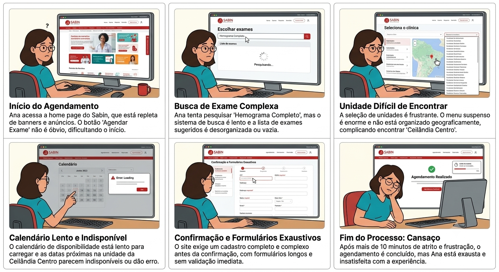
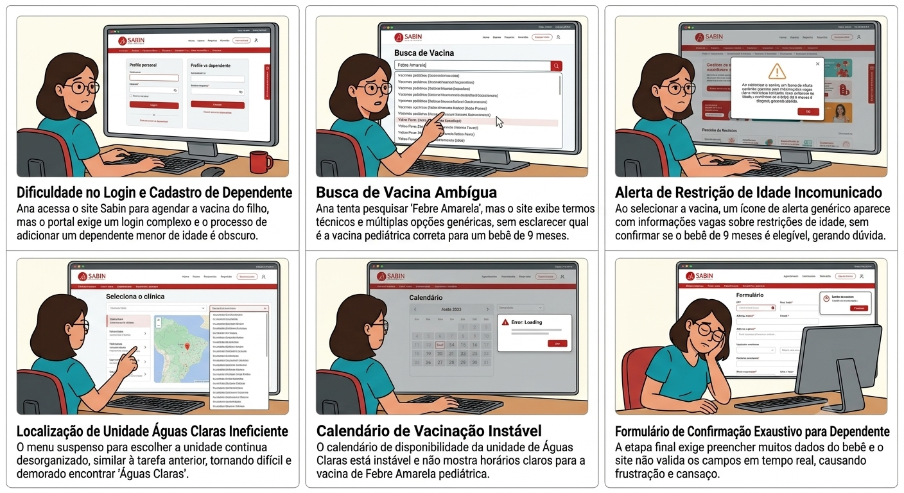
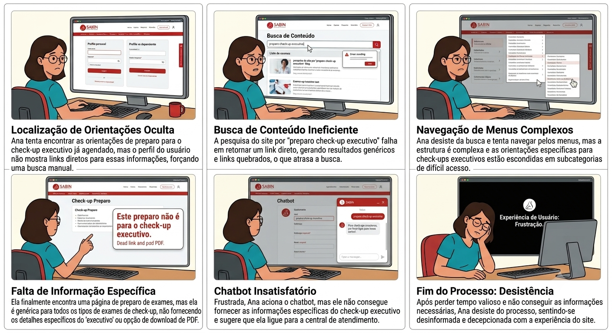
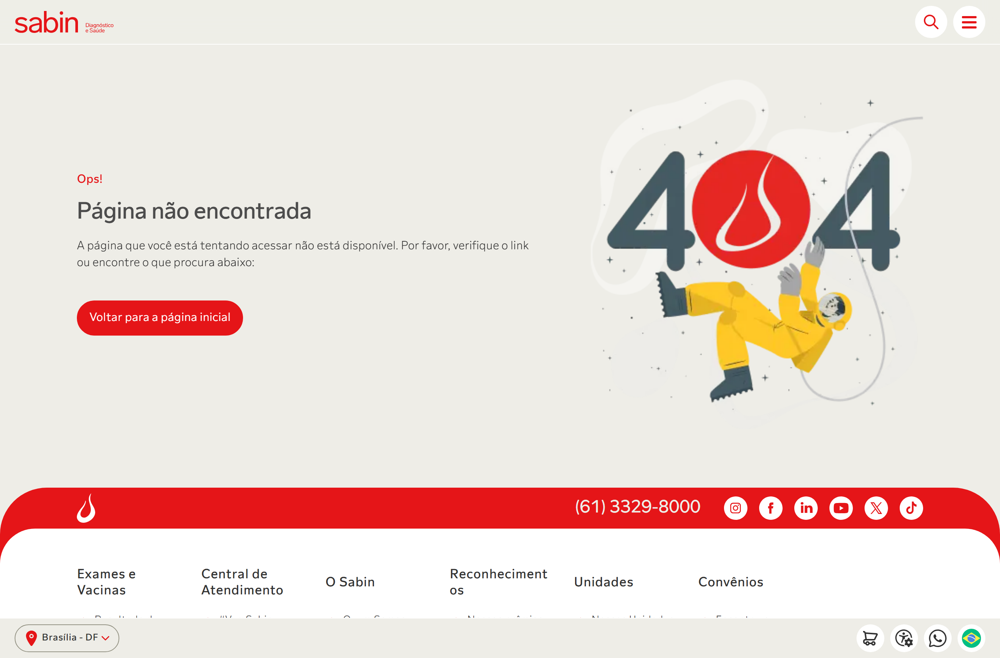

# Relatório Técnico — Teste de Usabilidade do Portal Sabin

> **Disciplina:** Interação Humano-Computador (IHC) — 2026.1
> **Instituição:** Universidade de Brasília (UnB)
> **Equipe:** Grupo 07
> **Site avaliado:** [sabin.com.br](https://www.sabin.com.br)
> **Método:** Think Aloud (Nielsen, 1993) + System Usability Scale (Brooke, 1996)
> **Referência da tarefa:** Tg_IHC-03
> **Data das sessões:** Junho/2026
> **Versão:** 1.0
> **Participantes:** P1, P2 e P3 (anonimizados conforme TCLE)

---

## Sumário

1. [Introdução](#1-introducao)
2. [Perfil do Usuário](#2-perfil-do-usuario)
3. [Metodologia e Roteiro](#3-metodologia-e-roteiro)
4. [Resultados](#4-resultados)
5. [Achados de Acessibilidade (WCAG 2.2)](#5-achados-de-acessibilidade-wcag-22)
6. [Recomendações Priorizadas](#6-recomendacoes-priorizadas)
7. [Reflexão Final](#7-reflexao-final)
8. [Referências](#referencias)
9. [Anexos](#anexos)

---

## Resumo Executivo

Mesmo com participantes de **alto letramento digital**, o fluxo de agendamento do
portal Sabin revelou-se confuso e pouco intuitivo. O termo **"Compra online"** não é
reconhecido como "agendar exame", o botão **"Agendar"** desvia o usuário para o
atendimento domiciliar sem aviso, e **não há etapa de escolha de data**. O resultado
é um **SUS médio de 41,7** (faixa "Inaceitável"). Em contraste, a tarefa de consultar
o preparo de um check-up (T3) foi resolvida sem dificuldade em ~35 s — confirmando que
o problema está **concentrado no fluxo de agendamento**, não no site como um todo.

| Indicador | Valor |
|---|---|
| Participantes (usuários reais) | 3 (P1, P2, P3) |
| Tarefas avaliadas | 3 (agendar exame, agendar vacina, ver preparo) |
| Taxa de sucesso na T1 (agendamento de exame) | **83,3%** (n=3) |
| SUS médio | **41,7 — Inaceitável** (n=3) |
| Problemas críticos/altos identificados | 3 (TU-01, TU-02, TU-03) |

---

## 1. Introdução

### 1.1 Contexto

Este relatório documenta o **teste de usabilidade empírico** conduzido pelo Grupo 07 da
disciplina de Interação Humano-Computador (IHC 2026.1, UnB) sobre o **portal Sabin
Diagnóstico e Saúde** ([sabin.com.br](https://www.sabin.com.br)), um site real e público
de uma das maiores redes de medicina diagnóstica do Brasil. A avaliação dá continuidade
às frentes anteriores do grupo — a **avaliação heurística** (TG-02) e a **avaliação de
acessibilidade** — agora validando empiricamente, **com usuários reais**, os problemas
antes previstos apenas por inspeção especialista.

O portal concentra tarefas centrais do paciente: agendar exames, agendar vacinas, consultar
instruções de preparo, localizar unidades e acessar resultados. Esta rodada foca nas
**jornadas não autenticadas** (sem login), por serem as de maior alcance e as que qualquer
participante consegue executar até o fim sem barreira de acesso.

### 1.2 Objetivo do teste

Avaliar a qualidade de uso do portal Sabin sob a perspectiva de usuários reais,
identificando problemas que dificultam a realização de tarefas centrais. Especificamente,
o teste busca:

1. Mensurar a **eficácia** (taxa de sucesso/conclusão) das tarefas definidas;
2. Mensurar a **eficiência** (tempo médio por tarefa — *time-on-task*);
3. Identificar **erros e pontos de fricção** cometidos espontaneamente pelos participantes;
4. Aferir a **satisfação subjetiva** por meio do questionário SUS;
5. **Cruzar** os achados empíricos com os problemas previstos na avaliação heurística (TG-02).

### 1.3 Fundamentação metodológica

O estudo articula métodos consagrados de IHC. O protocolo **Think Aloud** (verbalização
simultânea) de **Nielsen (1993)** orienta a coleta qualitativa; o instrumento validado
**System Usability Scale (SUS)** de **Brooke (1996)** mensura a satisfação; e as métricas
de eficácia, eficiência e erros seguem a abordagem de **Rubin & Chisnell (2008)** para
condução e análise de testes de usabilidade. As referências bibliográficas completas estão
listadas na [seção de Referências](#referencias).

---

## 2. Perfil do Usuário

### 2.1 Persona primária — "Ana"

O público real do portal Sabin é amplo (pacientes de todas as idades, cuidadores, usuários
de convênio). Para esta rodada, definiu-se uma **persona primária** e critérios objetivos de
recrutamento, conforme orienta Krug (2014).

| Atributo | Descrição |
|---|---|
| **Nome / idade** | Ana, 20 anos |
| **Ocupação / escolaridade** | Estudante de Engenharia de Software (ensino superior em curso) |
| **Dispositivo principal** | Smartphone, com uso eventual de notebook |
| **Frequência de uso da internet** | Diária e intensa (estudo, redes sociais, apps de serviço) |
| **Letramento digital** | Alto — usuária avançada, rápida em identificar padrões de interface |
| **Experiência com sites de saúde** | Já fez exames de rotina e de sangue presencialmente; usa pouco o site |
| **Contexto de uso** | Quer agendar exames sem telefonar, conferir preparo e acessar resultados online |
| **Frustrações** | Pouca paciência para fluxos longos; abandona e liga para a central se travar por 1–2 min |

### 2.2 Participantes recrutados

Foram recrutados **3 participantes reais** que se encaixam na persona, nenhum deles colega
da disciplina nem envolvido na elaboração do roteiro. Critérios de exclusão aplicados:
vínculo com o Sabin ou concorrente; experiência profissional em UX/Design; condução prévia
de testes de usabilidade.

| Participante | Perfil (idade / escolaridade / uso de internet) | Experiência com sites de saúde |
|---|---|---|
| **P1** | 20 anos, estudante de Eng. de Software, uso diário de internet, alto letramento digital | Já fez exames presencialmente; **nunca agendou pelo site** |
| **P2** | 19 anos, estudante de Eng. de Software, usa o **celular** como dispositivo principal | Já fez exames na unidade **Ceilândia Centro** |
| **P3** | Estudante de Eng. de Software (feminino); demais dados pela ficha de triagem | Conhece o Sabin; **uso pouco frequente** do site |

> **Contexto de uso (por que usam sites médicos):** os participantes representam usuários que
> recorrem ao portal para **agendar exames para si ou para familiares sem telefonar**, **conferir
> instruções de preparo** (jejum, restrições) antes de ir ao laboratório, **acessar resultados
> online** e **confirmar a unidade** mais conveniente.

### 2.3 Limitação de amostra

Os três participantes são estudantes de Engenharia de Software da mesma faculdade — amostra
**homogênea e tecnicamente fluente**. Problemas que afetam idosos, pessoas com baixa literacia
digital ou baixa visão podem **não** ter sido detectados nesta rodada. Os resultados são
**indicativos do fluxo**, não conclusivos sobre toda a base de usuários do Sabin. O fato de
até usuários fluentes terem encontrado dificuldades graves, porém, torna os achados ainda mais
relevantes: se a tarefa é difícil para quem domina tecnologia, tende a ser pior para o público
diverso real do laboratório.

---

## 3. Metodologia e Roteiro

### 3.1 Método: Think Aloud (Nielsen, 1993)

Adotou-se o protocolo **Think Aloud** (verbalização simultânea): durante cada tarefa, o
participante narra em voz alta o que pensa, procura, espera e o que o confunde. O avaliador
**não auxilia** durante as tarefas — salvo intervenção pontual registrada após travamento
prolongado — e responde a pedidos de ajuda com *"O que você tentaria fazer?"*. Cada sessão
seguiu um roteiro padronizado: boas-vindas e contextualização, tarefa de aquecimento, execução
das tarefas com verbalização, perguntas abertas pós-tarefa e questionário SUS.

| Item do procedimento | Especificação |
|---|---|
| **Modalidade** | Presencial, em ambiente controlado e silencioso |
| **Gravação** | Tela + áudio, mediante consentimento (TCLE assinado antes do início) |
| **Cronometragem** | Início na leitura completa da tarefa; fim na declaração do participante ou *timeout* de 5 min |
| **Desfecho registrado** | Sucesso sem ajuda / sucesso com ajuda / não concluiu |
| **Navegador** | Google Chrome atualizado, sem histórico/login do site, resolução 1366×768 |
| **Ética** | TCLE com objetivo, aviso de gravação, anonimato (P1–P3) e direito de desistência |

### 3.2 Tarefas e cenários

Foram redigidas **três tarefas representativas**, formuladas como **cenários de uso** (e não
como instruções literais da interface), todas **sem necessidade de login** e em fluxos distintos
do site.

> **Nota de escopo:** o template de entregáveis da disciplina sugere "5 tarefas"; a equipe
> definiu, no [planejamento](../docs/ihc-sabin/teste-usabilidade/planejamento.md), **3 tarefas
> representativas** que cobrem fluxos diferentes (exame, vacina, conteúdo informativo) e
> heurísticas distintas, suficientes para expor os problemas centrais sem fadigar o participante.

**Tarefa 1 — Agendamento de exame**
> *"Agende um exame de **hemograma completo** na unidade **Ceilândia Centro**."*
> **Sucesso:** chegar a uma tela do fluxo de agendamento com o exame e a unidade corretos
> selecionados. **Falha notável:** não localizar o exame/unidade ou cair em erro 404.

**Tarefa 2 — Agendamento de vacina (dependente)**
> *"Você quer agendar uma vacina de **febre amarela** no site, para o seu **filho de 9 meses**,
> na unidade **Águas Claras**."*
> **Sucesso:** chegar ao fluxo com a vacina e a unidade selecionados. **Observar:** se o site
> comunica claramente a restrição de idade (9 meses).

**Tarefa 3 — Busca de informação**
> *"Você quer ver as **orientações de preparo** para um agendamento de **check-up executivo**."*
> **Sucesso:** chegar à página do check-up executivo e indicar verbalmente as orientações de preparo.

Antes do teste, a equipe mapeou hipóteses de fricção para cada fluxo (storyboards), a serem
confirmadas ou refutadas pelas sessões reais:

*Figura 1. Storyboard de hipóteses de fricção da Tarefa 1 (agendamento de hemograma).*

*Figura 2. Storyboard de hipóteses de fricção da Tarefa 2 (vacina de febre amarela para dependente).*

*Figura 3. Storyboard de hipóteses de fricção da Tarefa 3 (preparo de check-up executivo).*

### 3.3 Métricas coletadas

| Métrica | Tipo | Instrumento / critério |
|---|---|---|
| **Taxa de sucesso (eficácia)** | Quantitativa | Planilha de observação: sem ajuda = 1,0 · com ajuda = 0,5 · não concluiu = 0 |
| **Tempo por tarefa (eficiência)** | Quantitativa | Cronômetro (início: leitura da tarefa; fim: declaração do participante ou *timeout* de 5 min) |
| **Número de erros** | Quantitativa | Contagem de cliques/seções erradas, redirecionamentos indevidos e voltas ao início |
| **Verbalizações espontâneas** | Qualitativa | Gravação de áudio + transcrição seletiva (*Think Aloud*) |
| **Satisfação subjetiva (SUS)** | Quantitativa | Questionário SUS (10 itens, escala 1–5), aplicado uma vez ao final da sessão |
| **Observações do avaliador** | Qualitativa | Notas livres durante a sessão |

> **Cobertura da coleta:** a **Tarefa 1** foi aplicada aos **3 participantes** (n=3); as
> **Tarefas 2 e 3**, apenas a **P3** (n=1), por dificuldade de conciliar agenda com P1 e P2. O
> questionário **SUS** foi respondido pelos **3 participantes** (n=3). As métricas a seguir
> deixam explícito o tamanho da amostra de cada tarefa.

---

## 4. Resultados

### 4.1 Resumo por participante e tarefa

| Part. | T1 — hemograma | T2 — vacina | T3 — preparo | SUS |
|---|---|---|---|---|
| **P1** | ✅ Sem ajuda · 240 s | — | — | 50 |
| **P2** | ✅ Sem ajuda · 195 s | — | — | 40 |
| **P3** | ⚠️ Com ajuda · ~240 s | ⚠️ Com ajuda · ~130 s | ✅ Sem ajuda · ~35 s | 35 |

> Legenda: ✅ concluiu sem ajuda · ⚠️ concluiu com ajuda do avaliador · — tarefa não aplicada ao participante.

### 4.2 Taxa de sucesso por tarefa (eficácia)

A taxa de sucesso pondera o desfecho: sucesso sem ajuda = 1,0; sucesso com ajuda = 0,5;
não concluiu = 0. A taxa é a média ponderada dividida pelo nº de participantes da tarefa.

| Tarefa | Cálculo | Taxa de sucesso |
|---|---|---|
| **T1 — Agendar hemograma** (n=3) | (1,0 + 1,0 + 0,5) ÷ 3 | **83,3%** |
| **T2 — Agendar vacina** (n=1) | 0,5 ÷ 1 | **50,0%** |
| **T3 — Ver preparo** (n=1) | 1,0 ÷ 1 | **100%** |

Embora a T1 registre 83,3% de eficácia, a leitura cruzada é reveladora: a tarefa de
**busca de informação (T3)** teve **100% e ~35 s**, enquanto as tarefas de **agendamento
(T1/T2)** exigiram muito mais tempo e ajuda. O gargalo está claramente no **fluxo de
agendamento**, não na consulta de conteúdo.

### 4.3 Tempo médio por tarefa (eficiência)

| Tarefa | Tempos individuais | Tempo médio |
|---|---|---|
| **T1** (n=3) | 240 s · 195 s · ~240 s | **~225 s** (≈ 3 min 45 s) |
| **T2** (n=1) | ~130 s | **~130 s** (≈ 2 min 10 s) |
| **T3** (n=1) | ~35 s | **~35 s** |

O contraste de eficiência é eloquente: encontrar uma informação (T3) levou ~35 s, enquanto
iniciar um agendamento (T1) consumiu, em média, **mais de 6× esse tempo**.

### 4.4 Número de erros

Contabilizam-se como **desvios** as seções/redirecionamentos incorretos percorridos antes do
caminho certo, e como **dicas** as intervenções do avaliador. Os números abaixo derivam do
fluxo documentado de cada sessão.

| Part. | Tarefa | Desvios | Dicas do avaliador | Desfecho |
|---|---|---|---|---|
| P1 | T1 | 4 | 0 | Sem ajuda |
| P2 | T1 | 3 | 0 | Sem ajuda |
| P3 | T1 | 6 | 2 | Com ajuda |
| P3 | T2 | 3 | 1 | Com ajuda |
| P3 | T3 | **0** | 0 | Sem ajuda |

Padrões observados nos erros de agendamento (T1/T2):

- **Exploração de seções informativas erradas** antes de achar o caminho ("Exames
  laboratoriais", "Preparo de exames", "Serviços digitais", "Pré-cadastro", "Conteúdo de apoio").
- **Redirecionamento inesperado** ao clicar em "Agendar o exame", que leva ao **atendimento
  móvel/domiciliar** sem aviso.
- **Ausência de botão "voltar" interno**, levando P2 a usar o "voltar" do navegador e **perder
  a busca preenchida**.

### 4.5 Escore SUS

O questionário SUS (10 itens, escala 1–5) foi aplicado uma vez por participante, ao final da
sessão. O escore varia de 0 a 100; valores abaixo de 50 são considerados de usabilidade
**inaceitável**.

| Participante | Escore SUS | Classificação |
|---|---|---|
| P1 | 50 | 🟡 Mediano (50–68) |
| P2 | 40 | 🔴 Inaceitável (< 50) |
| P3 | 35 | 🔴 Inaceitável (< 50) |
| **Média (n=3)** | **41,7** | 🔴 **Inaceitável (< 50)** |

> **Nota sobre a média:** com os 3 escores coletados, a média é (50 + 40 + 35) ÷ 3 = **41,7**.
> Materiais parciais anteriores do grupo citavam "45" — valor que correspondia à média de **n=2**
> (apenas P1 e P2), antes de a sessão de P3 ser computada. Este relatório consolida os **3
> participantes**.

**Detalhamento por item (P3 — único com respostas item a item registradas):**

| # | Afirmação (SUS) | Resposta (1–5) | Observação |
|---|---|---|---|
| 1 | Gostaria de usar o site com frequência | 2 | Frustração no agendamento; só a T3 foi tranquila |
| 2 | Site desnecessariamente complexo | 4 | "Muita informação"; perdeu-se em várias telas |
| 3 | Site fácil de usar | 2 | Difícil em 2 das 3 tarefas |
| 4 | Precisaria de suporte técnico | 3 | Precisou de dicas, mas é usuária fluente |
| 5 | Funções bem integradas | 2 | "Comprar" para agendar quebra o modelo mental |
| 6 | Muita inconsistência | 4 | "Agendar" leva ao atendimento móvel; nomenclatura confusa |
| 7 | Maioria aprenderia rapidamente | 2 | Mesmo sendo da área de TI, ficou perdida |
| 8 | Site muito difícil de usar | 4 | Difícil em T1 e T2 |
| 9 | Senti-me confiante | 3 | Concluiu tudo e agiu com confiança na T3 |
| 10 | Precisei aprender muita coisa | 2 | Mais questão de achabilidade do que de aprendizado |

**Cálculo (P3):** ímpares (1,3,5,7,9) = (2+2+2+2+3) − 5 = **6**; pares (2,4,6,8,10) =
25 − (4+3+4+4+2) = **8**; total (6 + 8) × 2,5 = **35 pontos**.

> Para P1 (50) e P2 (40), apenas os escores finais foram registrados na coleta — não há
> transcrição item a item dessas duas sessões, por isso não se exibe aqui o detalhamento delas.

### 4.6 Verbalizações marcantes (Think Aloud)

> *"Eu achei bem complicado. Os nomes não eram o que eu estava esperando [...] tive que entrar
> em várias outras páginas para conseguir achar esse hemograma completo, que não estava onde eu
> estava esperando."* — **P1 (T1)**

> *"Eu senti falta também na questão da data."* — **P1 (T1)**

> *"Achei os termos um pouco confusos… a primeira opção é agendar exame, mas ele vai para um
> local que não faz sentido, que é o atendimento domiciliar. A opção certa é comprar exame, que
> pra mim faria mais sentido você agendar, né?"* — **P2 (T1)**

> *"Senti falta de não ter como selecionar um local e uma data."* — **P2 (T1)**

> *"Vou apertar no botão de agendamento, que faz sentido."* … *"Acho que não é aqui, né, mano?
> Não tô achando."* … *"Não consigo voltar pra parte inicial."* … *"Isso aqui é um tipo de
> atendimento móvel, não é isso? E como é que eu vou agendar?"* … *"Ah, tá. Então eu tenho que
> comprar meu exame aqui primeiro."* — **P3 (T1)**

> *"Orientações de preparo. Achei."* — **P3 (T3, único fluxo tranquilo)**

> *"Também foi bem difícil de achar o lugar certo, porque eu não imaginaria que fazer uma compra
> online me levaria a agendar uma vacina pra criança."* — **P3 (feedback final)**

### 4.7 Problemas de usabilidade consolidados

| ID | Problema observado | Participante(s) | Severidade | Heurística relacionada |
|---|---|---|---|---|
| **TU-01** | Nomenclatura ambígua ("Compra online" vs "Agendar exame" vs "Serviços digitais") não corresponde ao modelo mental do usuário | P1, P2, P3 | 🔴 Crítico | H2 — Mundo real / H4 — Consistência |
| **TU-02** | Botão "Agendar o exame" redireciona para atendimento móvel sem aviso e sem opção clara de voltar | P2, P3 | 🟠 Alto | H3 — Controle / H5 — Prevenção de erros |
| **TU-03** | Ausência de etapa para seleção de data e horário no fluxo de agendamento | P1, P2 | 🔴 Crítico | H1 — Visibilidade do status |
| **TU-04** | Sobrecarga de informação na listagem de vacinas, sem campo de busca evidente | P3 (T2) | 🟡 Médio | H8 — Estética e design minimalista |

---

## 5. Achados de Acessibilidade (WCAG 2.2)

Embora a rodada não tenha incluído participante com deficiência, as tarefas percorreram
elementos que impactam diretamente a acessibilidade. Os achados abaixo combinam o que foi
**observado/confirmado ao vivo** durante as sessões com a inspeção técnica das mesmas telas
(documentada na avaliação de acessibilidade do grupo).

### 5.1 Achados relevantes ao fluxo testado

| Critério WCAG 2.2 | Constatação no fluxo testado | Status |
|---|---|---|
| **3.2.4 — Identificação consistente** (AA) | A ação de agendar aparece como "Compra online", "Agendar exame", "Serviços digitais" e "Solicitar atendimento" — confirmado **empiricamente**: os 3 participantes não reconheceram o caminho correto. | 🔴 Não conforme |
| **1.3.1 / 2.4.2 — Títulos e semântica** (A) | Homepage **sem `<h1>`** (confirmado ao vivo, 26/06/2026): usuário de leitor de tela não identifica o título da página de partida das tarefas. | 🔴 Não conforme |
| **2.4.1 — Skip links** (A) | Nenhum link "pular para o conteúdo": navegação por teclado tabula por todo o menu antes de chegar ao conteúdo. | 🔴 Não conforme |
| **2.4.7 — Foco visível** (AA) | Ausência de `:focus-visible`: a posição do teclado fica imperceptível nos botões dos fluxos de agendamento. | 🔴 Não conforme |
| **1.4.3 — Contraste mínimo** (AA) | Textos de apoio em `#999` (~2,85:1), abaixo do mínimo de 4,5:1. | 🔴 Não conforme |
| **3.3.1 — Identificação de erros** (A) | Portal de resultados sem `<label>` nem orientação de formato da credencial (fluxo correlato, fora do escopo sem login). | 🔴 Não conforme |

*Figura 4. Página de partida das tarefas — o primeiro cabeçalho é um `<h2>`; não há `<h1>`, prejudicando a orientação por leitor de tela (WCAG 1.3.1 / 2.4.2).*

### 5.2 Cruzamento com a Avaliação Heurística (TG-02)

A rodada empírica **confirmou** problemas previstos na [avaliação heurística](../docs/ihc-sabin/avaliacao-heuristica/index.md)
(IDs HE-xx) e na avaliação de acessibilidade do grupo. O destaque é que a inconsistência de
nomenclatura, antes apontada apenas por inspeção, **foi vivida pelos três participantes**.

| Achado do teste | Heurística (TG-02) | WCAG | Confirmado no teste? |
|---|---|---|---|
| **TU-01** — "Compra online" não é reconhecido como agendar | HE-07 (H4 — Consistência) | 3.2.4 | ✅ Confirmado (P1, P2, P3) |
| **TU-02** — "Agendar" desvia ao atendimento móvel sem saída | HE-05 / HE-18 (H3 / H9) | 2.4.1 / 3.2.3 | ✅ Confirmado (P2, P3) |
| **TU-03** — Fluxo de agendamento incompleto (sem data) | HE-05 (rota `/agendamento/` → 404) | — | ✅ Confirmado (P1, P2) |
| Homepage sem `<h1>` | HE-11 (H6) | 1.3.1 / 2.4.2 | ✅ Confirmado ao vivo |
| Densidade visual / sobrecarga de informação | HE-16 (H8) | — | ✅ Confirmado (P3, T2: *"muita informação"*) |

> **Relação com o achado catastrófico do site:** a avaliação heurística (TG-02) identificou que
> a rota `sabin.com.br/agendamento/` — divulgada como CTA "Agendamentos #VemSabin" — retorna
> **erro 404** (HE-05 / HE-18, severidade Catastrófica). Os participantes tentavam concluir
> exatamente esse fluxo de agendamento; a fragilidade do caminho central é a raiz comum dos
> problemas TU-01, TU-02 e TU-03.

*Figura 5. A rota `sabin.com.br/agendamento/` retorna erro 404 — o fluxo que os participantes tentavam concluir é, na prática, frágil e inconsistente.*
